# Decision Trees

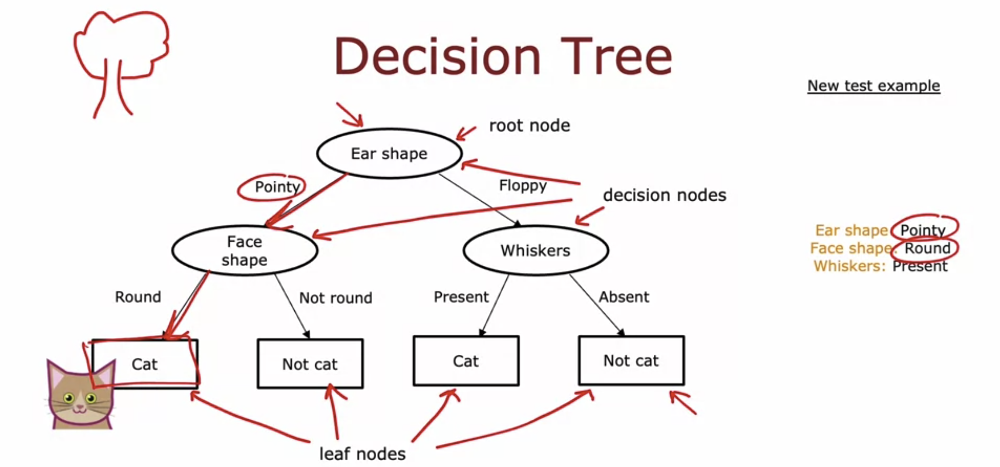

The top node is called root node. The bottom nodes are called the leaf nodes. The nodes in between are called decision nodes. 

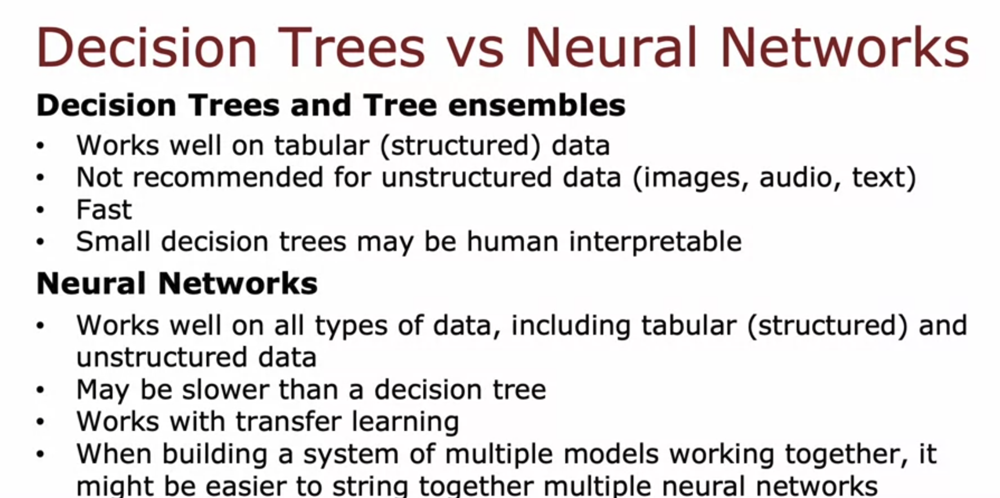

## Entropy

Entropy is a measure of the impurity of a set of data. 

Let p1 be the fraction of examples that are cats, p0 be the fraction that are not cats. H(p1) gives us the entropy of p1 where H is the entropy function. 

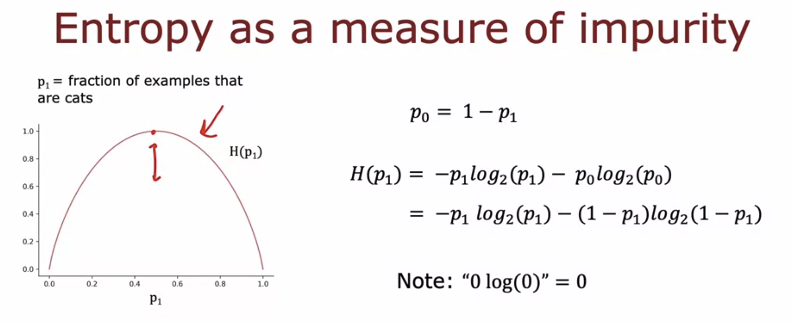

## Choosing a split and Information Gain

We first calculate the entropy of both the left and right branches for all the features. Now we take a weighted average of both these values ( fraction of examples as weight ), because if there are a lot of examples in one sub-branch, then it is important to keep its entropy low. 

**Now, take this weighted average and subtract it from the entropy of the top node, and this value is called the information gain.** 

**Information Gain measures the reduction in ​entropy that you get in ​your tree resulting from making a split. We choose the splitting feature which has the highest Information Gain.**

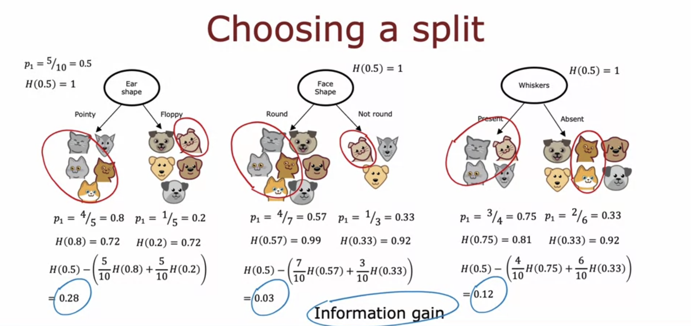

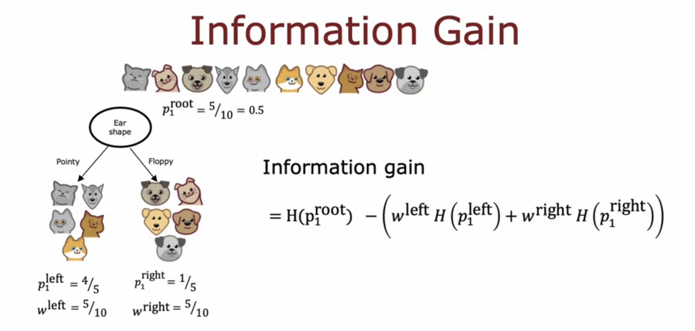

p1 is the fraction of examples in that branch which are cats,  
w is the number of examples / total examples in that branch 

**One of the factors to decide when to stop splitting is when the Information Gain ( reduction in entropy ) is lower than the required threshold. So it is better to stop, because after that point, adding more depth and overcomplicating leads to overfitting.**

## Learning Process

At each point, we select a feature ( decision ) that splits the data by maximum information gain and do this recursively. 

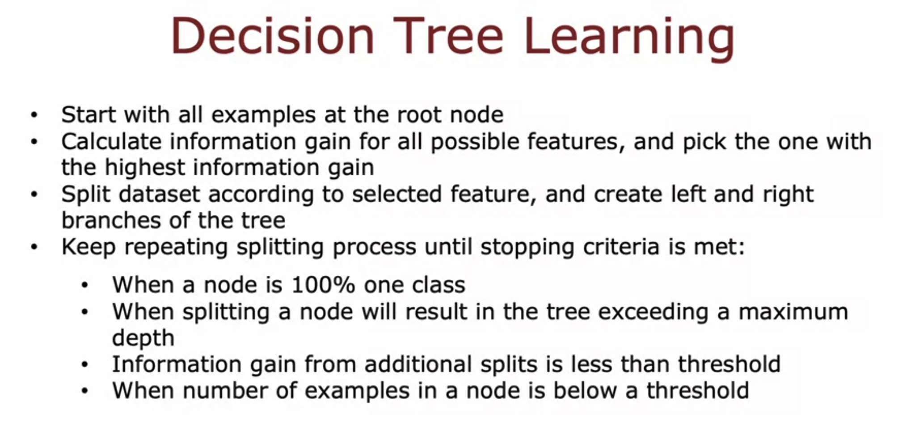

## One hot encoding - Features having more than two values

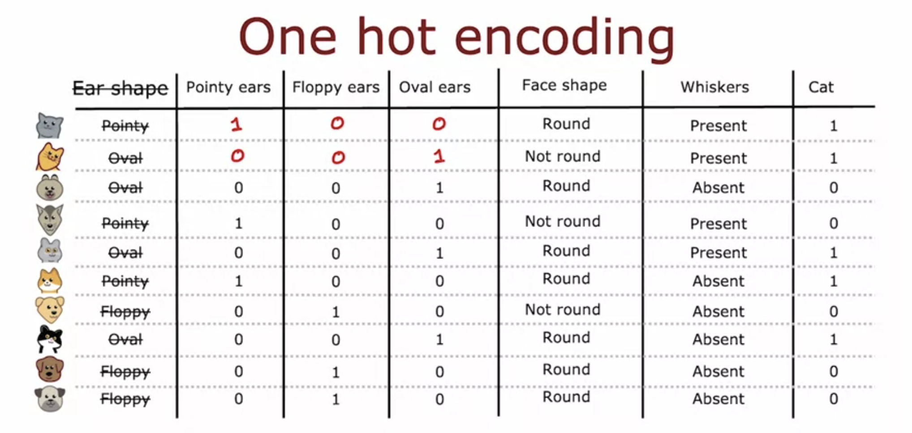

If a categorical feature ( feature having more than two values ) can take on k values, create k binary features ( 0 or 1 valued )

## Continuous Valued Features

Continuous valued features are features that can take on any value ( not just predefined values like 1, 2, 3 etc )

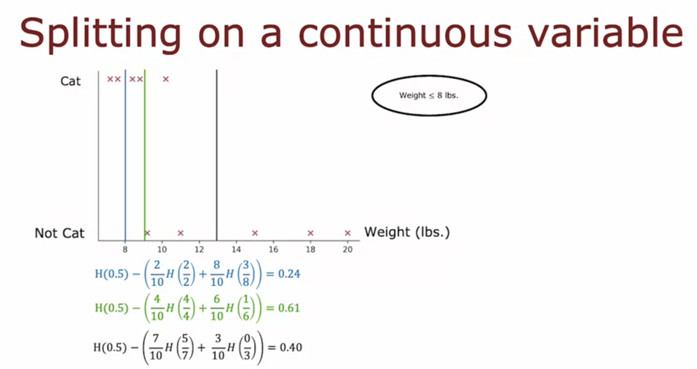

Conventionally, we sort the feature by the value and take decision threshold in the midpoint between the values and calculate the information gain. Splitting is done at the decision threshold with maximum information gain

## Regression Trees

We classify the test example with decision trees, and then predict its y by taking the average of all the examples present in that class during training. 

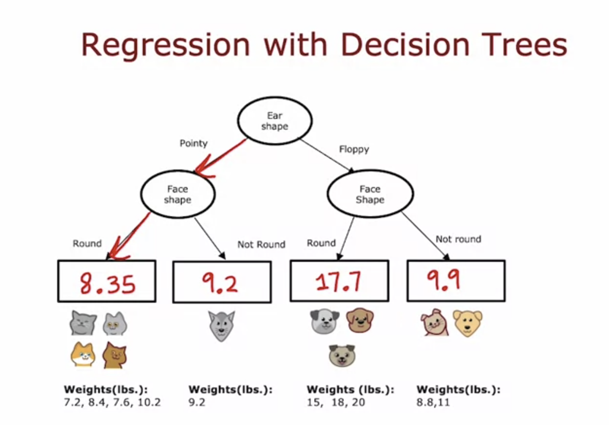

### Choosing a Split

For choosing a split in regression trees, we take the feature which has the **least weighted variance** ( instead of highest information gain in normal decision trees ).

**We take the variance at root node and subtract it from the weighted variance of the branches to get the reduction in variance, and pick the feature which has the largest reduction in variance.**

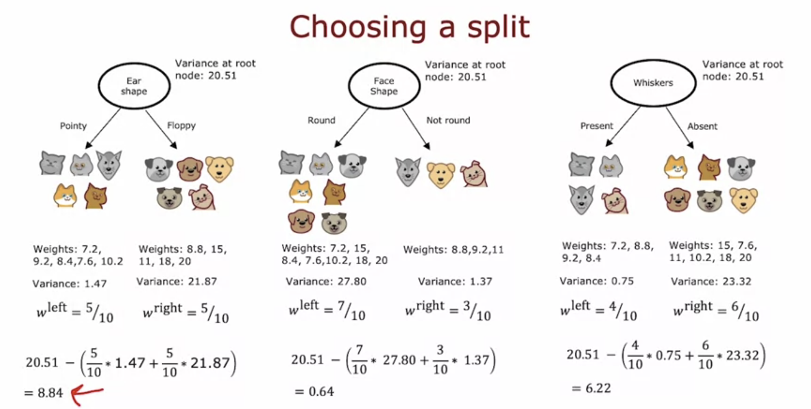

>[Decision Trees](../labs/Course%202/Week%204/C2_W4_Lab_01_Decision_Trees.ipynb)

## Tree ensembles

In the training data, changing one example can change the information gain of all the features, and hence the decision tree changes completely. The fact that changing just one training example causes ​the algorithm to come up with ​a different split at the root and ​therefore a totally different tree, ​that makes this algorithm just not that robust. 

​That's why when you're using decision trees, we get more accurate predictions if we train not ​just a single decision tree ​but a whole bunch of different decision trees. This is called a tree ensemble, i.e. a collection of multiple trees. We can run the prediction on all the trees and get them to vote for the final prediction. 

### Sampling with Replacement

Assume all the training examples are in a theoritical bag. Pick an example randomly, put it in the new training set, and then back in the bag ( repeats allowed ). This is called sampling with replacement and is used to create new training sets.

### Random Forest Algorithm

We perform sampling with replacement on the original training set, and create a decision tree for this training set, and by doing this with multiple sampled training sets, we get multiple decision trees. The final prediction is done by taking the votes of each decision tree predictions. 

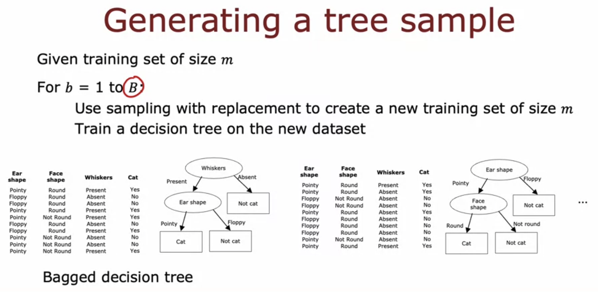

Along with this, we randomly select k features out of n, this is called the Random Forest Algorithm

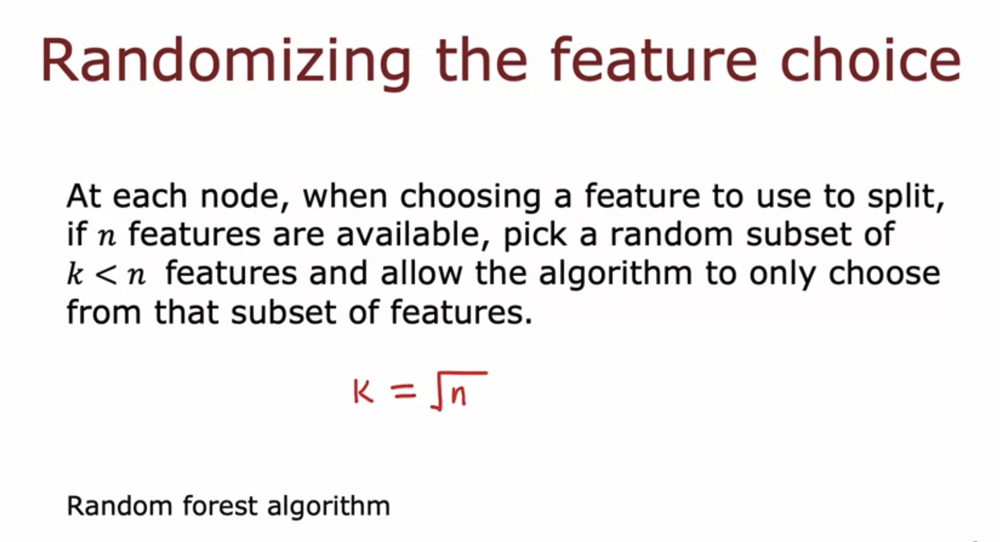

For large n, we generally take k = square root of n

​One way to think about why random forest is more robust to than a single decision tree is ​the sampling with replacement procedure causes the algorithm to explore a lot of ​small changes to the data already and it's training different decision trees and ​is averaging over all of those changes to the data that the sampling ​with replacement procedure causes. ​And so this means that any little change further to the training set makes it less ​likely to have a huge impact on the overall output of the overall random ​forest algorithm. ​Because it's already explored and ​it's averaging over a lot of small changes to the training set. 

### XGBoost

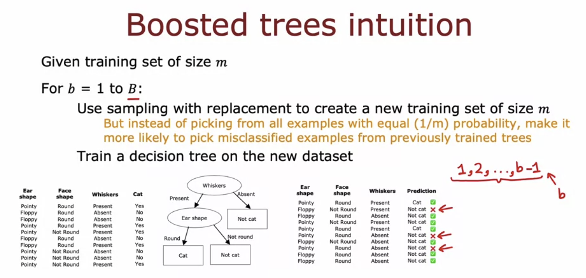

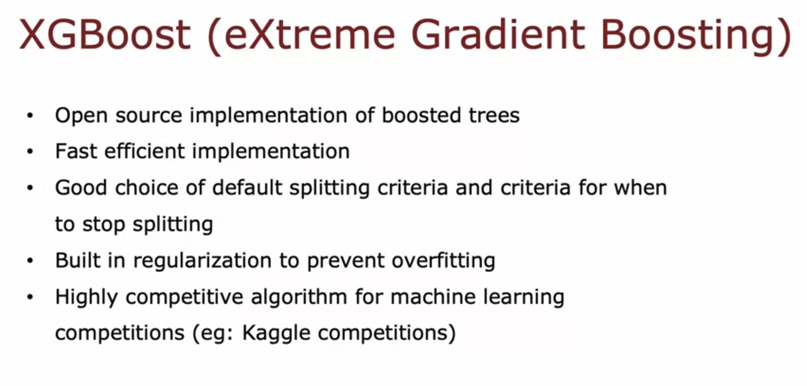

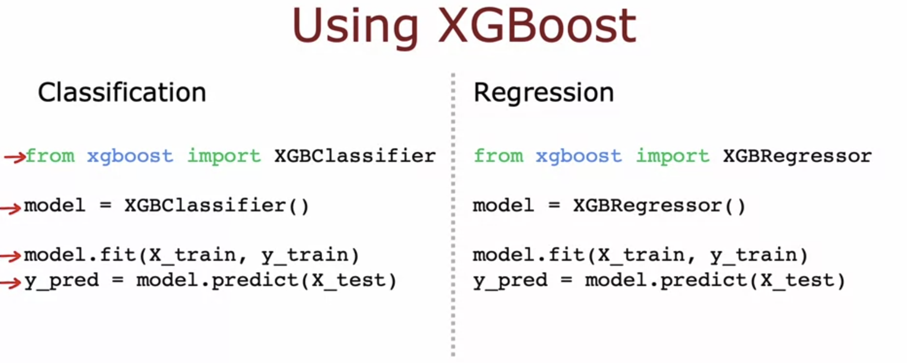

>[Tree Ensembles](../labs/Course%202/Week%204/C2_W4_Lab_02_Tree_Ensemble.ipynb)