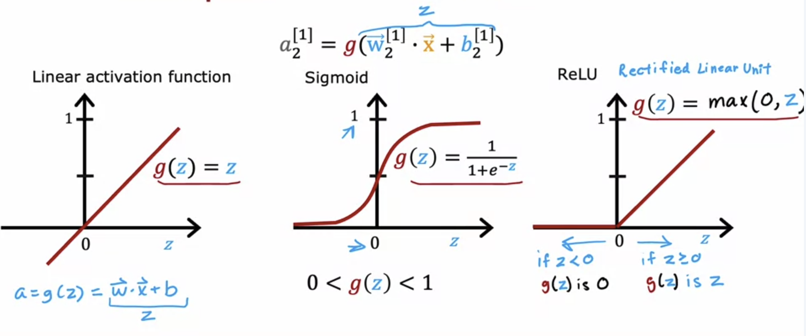
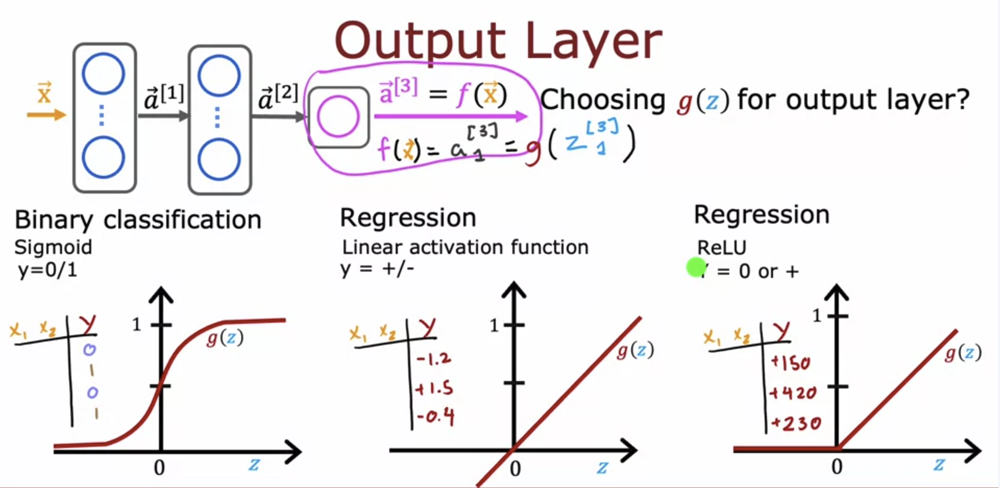
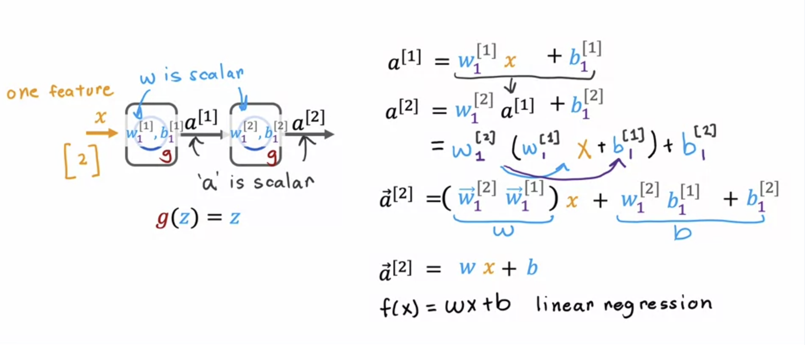

# Activation Functions 

The activation function is the function g which takes z ( wx+b ) as input and outputs the activation of that unit/neuron.  

In the previous Demand Prediction examples, we used Logistic Regression, and hence used sigmoid as the activation function.  

Another common activation function is the **ReLU activation ( Rectified Linear Unit )**

## Choosing Activation Functions

Depending on what ​the target label or the ground truth label y is, ​there will be one fairly natural choice ​for the activation function for the output layer.

For the Output, if y can only be 0/1 ( classification ), then we choose a sigmoid activation.  
If y can be any positive / negative value ( linear regression ), then we choose a linear activation function.  
If y can only be positive or zero, then we choose a ReLU activation.  

**For Hidden Layers ( middle layers ), generally ReLU is used in majority cases.**  
One of the reasons is that ReLU is faster to compute than Sigmoid since it only has to compute one max operation.  
Another significant reason is that the sigmoid function has two flat regions ( infinity and negative infinity ), and gradient descent runs slower in these flat regions.  

## Why we need Activation Functions

The activation function is required in neural networks because if we just use a linear activation function ( g(z) = z = wx+b ), then the output of the neural network will just be the same as linear regression.

Similarly, if we use linear activation functions for all hidden layers, and logistic activation function just for the output layer, then the neural network is equivalent to a logistic regression model.  

>[ReLU Activation](../labs/Course%202/Week%202/C2_W2_Relu.ipynb)
