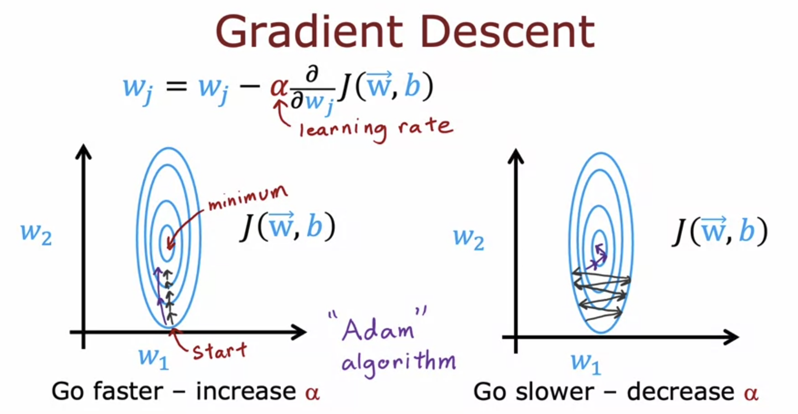
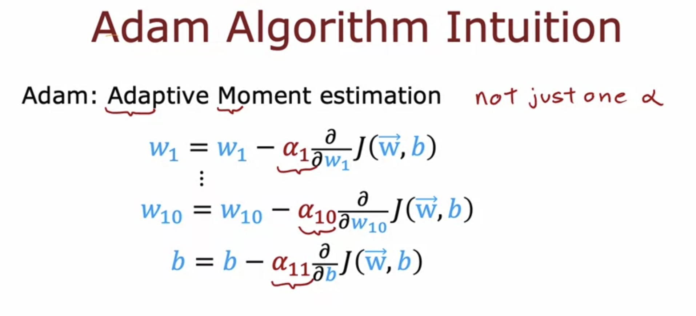
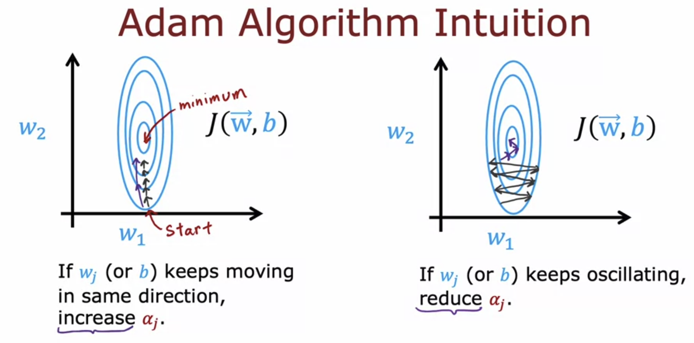
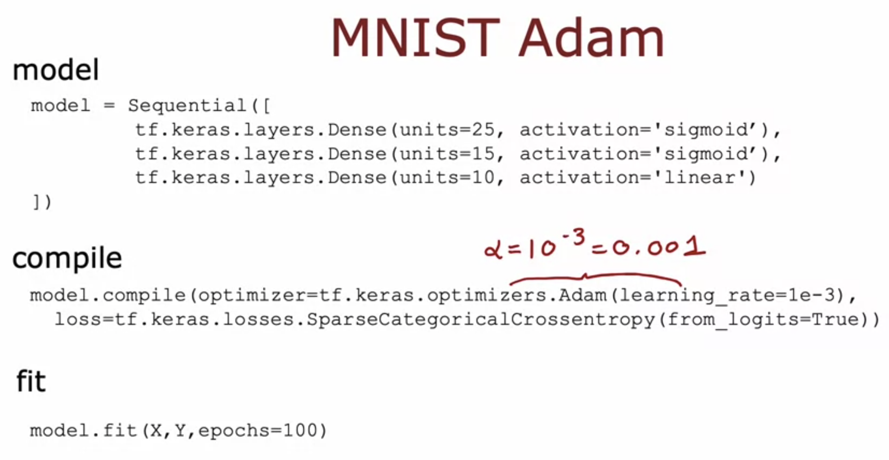
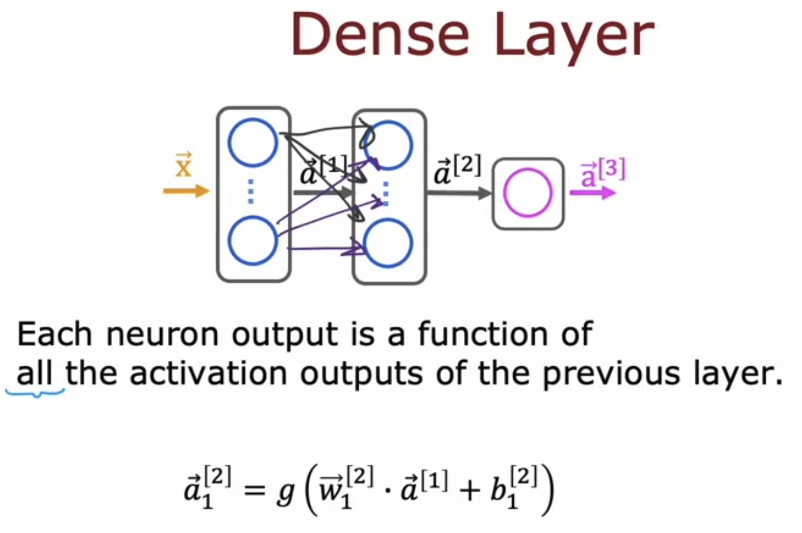
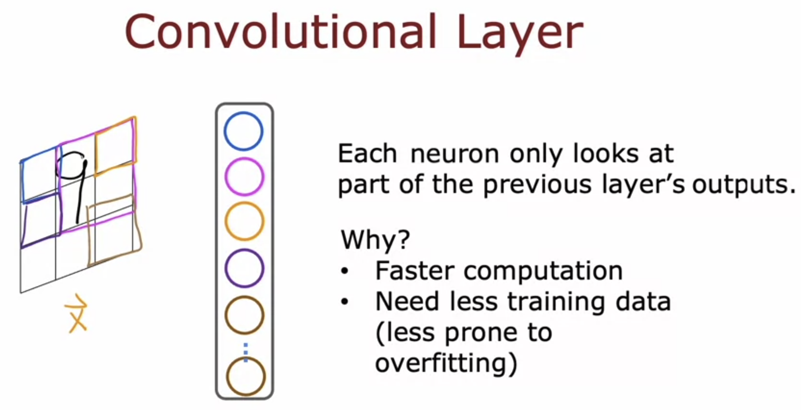
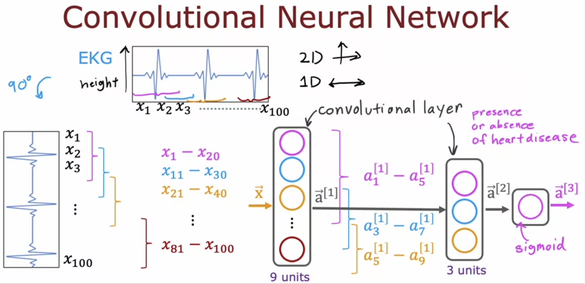

# Additional Neural Networks Concepts

## Advanced Optimization - Adam Algorithm

Till now, we had only used Gradient Descent to find the optimal parameters for our model by minimizing the cost function.   
There are other algorithms too that are better than Gradient Descent at minimizing the cost function.

## Additional Layer Types

Till now, we have only used Dense Layer types in Tensorflow, which take the input from the previous layer's output. 

### Convolutional Layer

