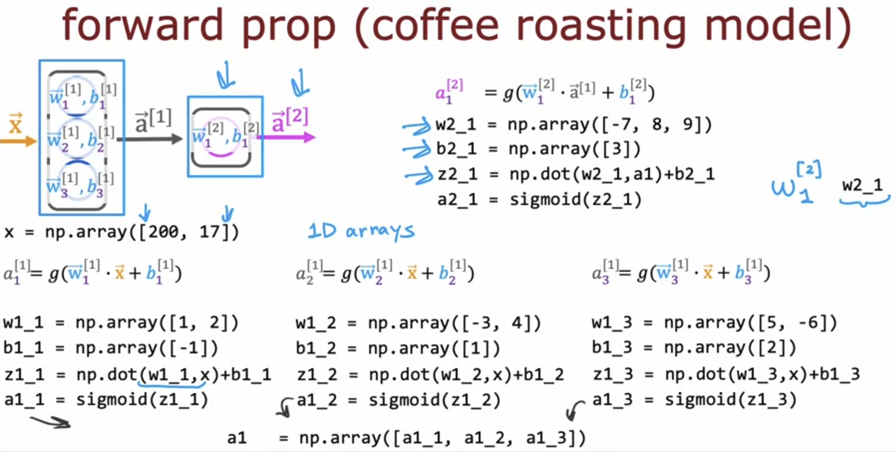
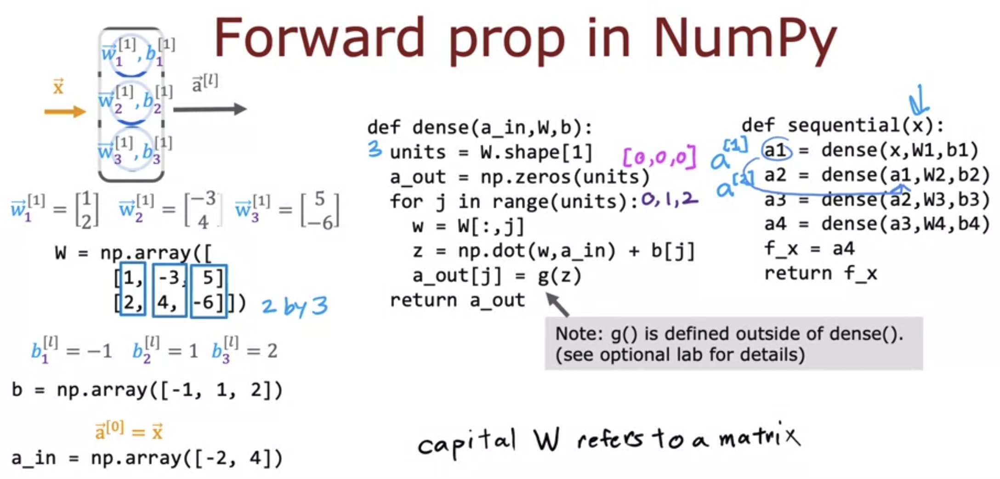
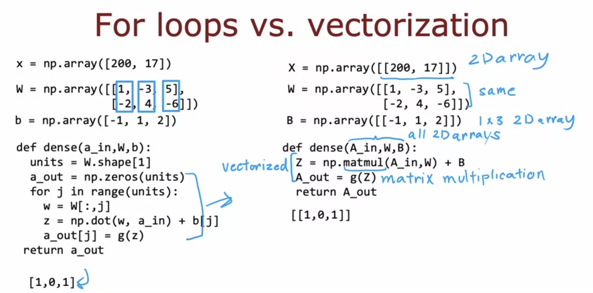
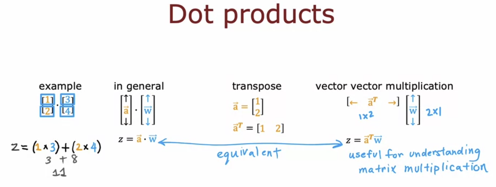
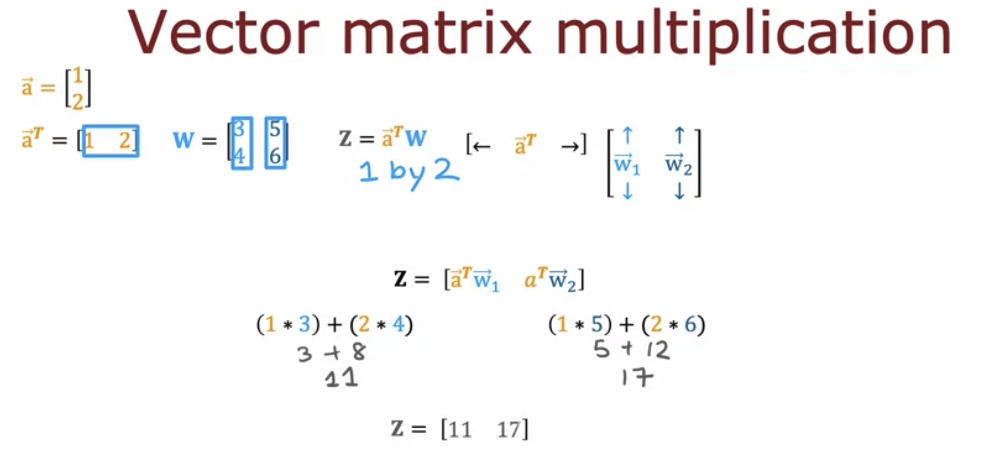
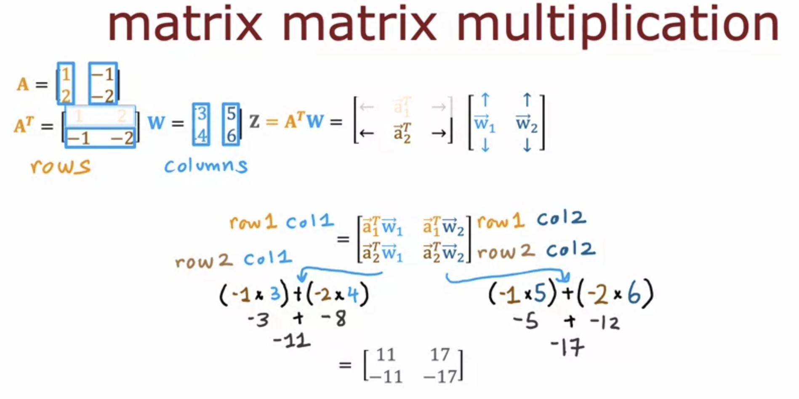
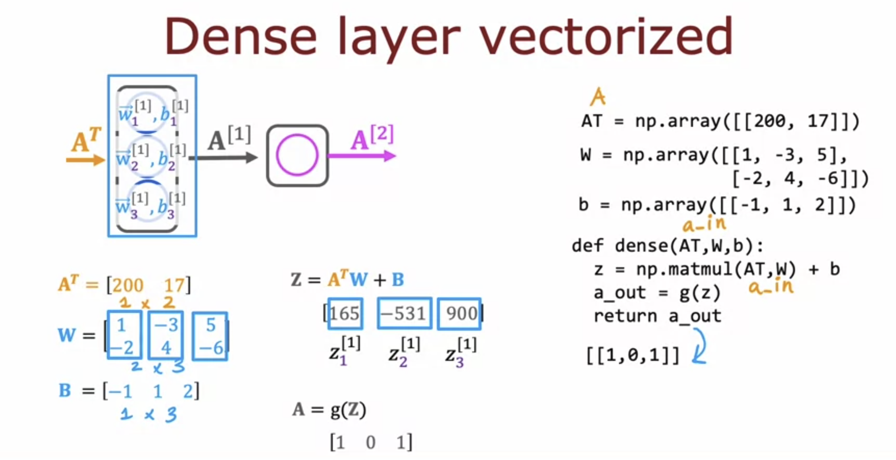

# Implementing Neural Networks without Tensorflow and Vectorization

We can calculate each unit of each layer seperately like this, and then create a 1D numpy array of all units which will be the activation of that layer. 

Instead of doing this one by one for all units, we can create dense and sequential functions. 

**The dense function takes the activation of previous layer, and parameters w and b as inputs, and outputs the activation of the current layer.**

**The sequential function function combines all the middle layers ( dense functions ), so it takes the input x and directly outputs the final output.**

>[!NOTE]
w = W[;, j] pulls the j'th column in python. So it will pull w1_1 , w1_2, w1_3 and so on.  
Capital Notation represents a matrix, Lowercase notation represents a vector. 

>[Implementing Neural Networks without Tensorflow in Python](../labs/Course%202/Week%201/C2_W1_Lab03_CoffeeRoasting_Numpy.ipynb)

## Vectorization

W is already a Matrix ( 2D array ), by making X and B matrices, we can directly carry out matrix mutiplication to calculate z. This is simpler and faster than using for loops. 

### Matrix Multiplication

In Dot Product of matrices, each row element of the first matrix is multiplied with that row element of the second matrix, and then the final sum is taken. 

This is equivalent to taking the transpose of the first matrix and multipying it directly with the second matrix. 

The first vector can be considered a 1x2 matrix, the second matrix is a 2x2. Hence, the product will be 1x2 matrix

The first column element will be the ( first row of first matrix * first column of second matrix ) element.  
Similarly, the second column element will be ( first row of first matrix * second column of second matrix )

### Implementing in Code

We can find the transpose using AT = A.T where A is an np.array object. 
We can further calculate Z=AT * W by using Z = np.matmul(AT, W). This can also be alternatively written as Z = AT @ W

