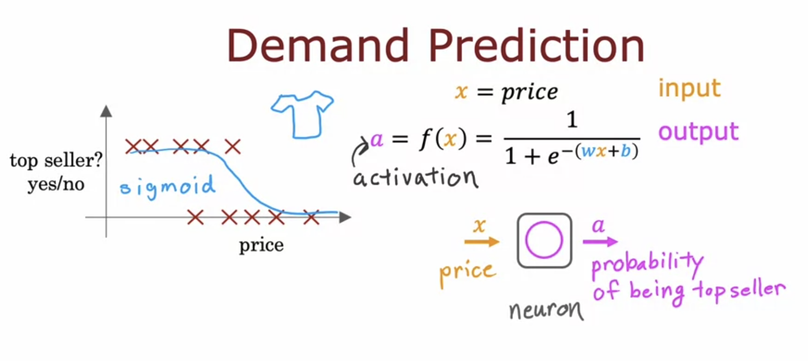
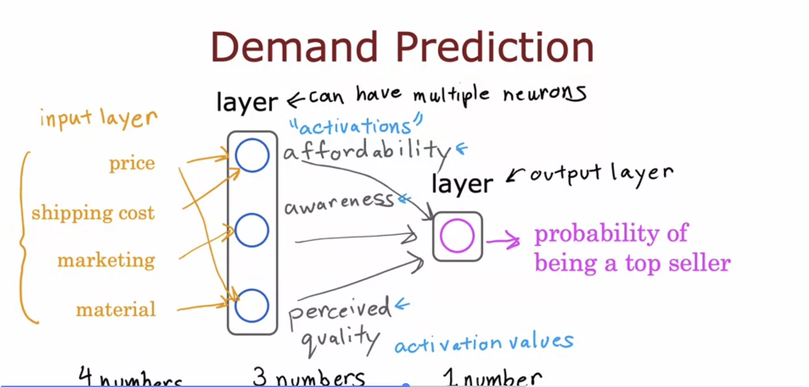
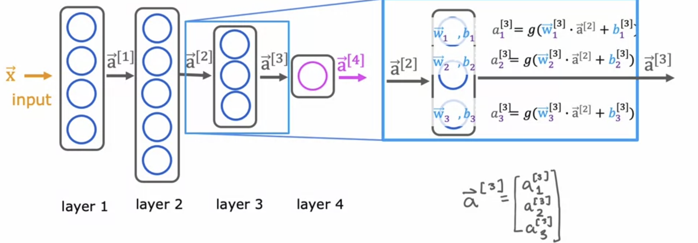
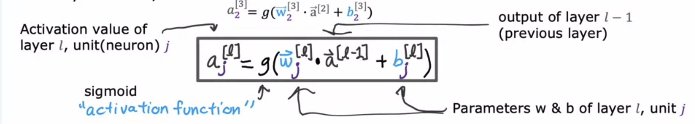
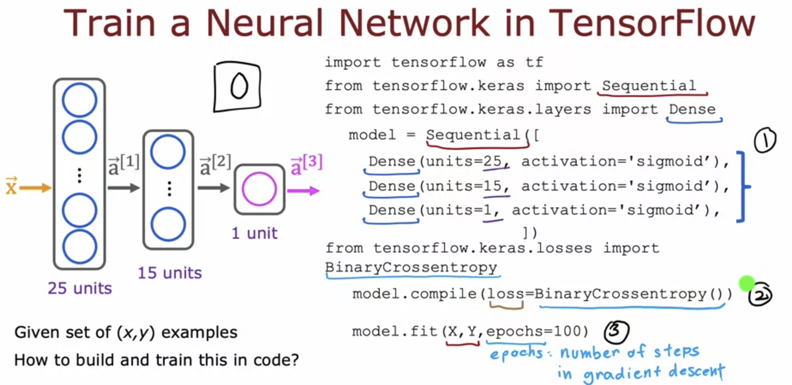
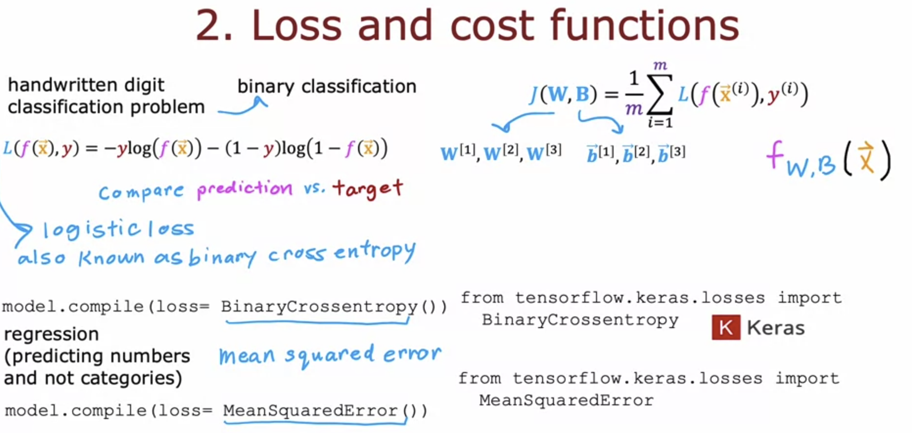

# Introduction to Neural Networks 

A neuron can be thought of as a small computer whose job is to input one or a few numbers and then output one or maybe a few numbers. A neural network is a system of neurons working together where the output of one might act as an input for another. 

Considering an example of demand prediction, in which one tries to predict whether a product will be a top seller or not.

If we use a logistic regression model here in the neuron, **the output of the model is called the activation of the neuron, which refers to how much a neuron is sending a high output.** 

Here is a little complex version of how this neural network might look like

The features are price, shipping cost, marketing and material.
**A layer is a grouping of neurons which take the same or similar features and inputs.** Hence the affordability, awareness and perceived quality are the activations ( outputs ) of the first layer of neurons, and the probability of being a top seller is the activation of second layer or the output layer. The features are called the input layer. In reality, all the neural networks in the layer recieve all the features in input, and they learn to ignore the ones which are not required. For example, the affordability neuron will recieve all features in input, but ignore others since it only uses price and shipping cost.

To simplify the notation, the input layer ( features ) are written as vector x, which is fed to the next layer. The output vector of this layer is fed to the next layer and so on.

The output of layers are denoted by a superscript of the layer number above a.

The middle layers are called the hidden layers and we don't see them in the training set. 

Forward Propagation is the mechanism in which we predict the output by providing the input to the model. 

>[Using Tensorflow and Keras](../labs/Course%202/Week%201/C2_W1_Lab01_Neurons_and_Layers.ipynb)

## Training a Neural Network

Step 1 is to specify the model, ​which tells tensorflow how to compute for the inference.  
​Step 2 compiles the model ​using a specific loss function, ​and step 3 is to train the model. 

BinaryCrossentropy is another name for logistic loss.

