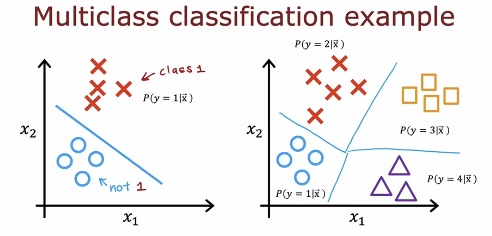
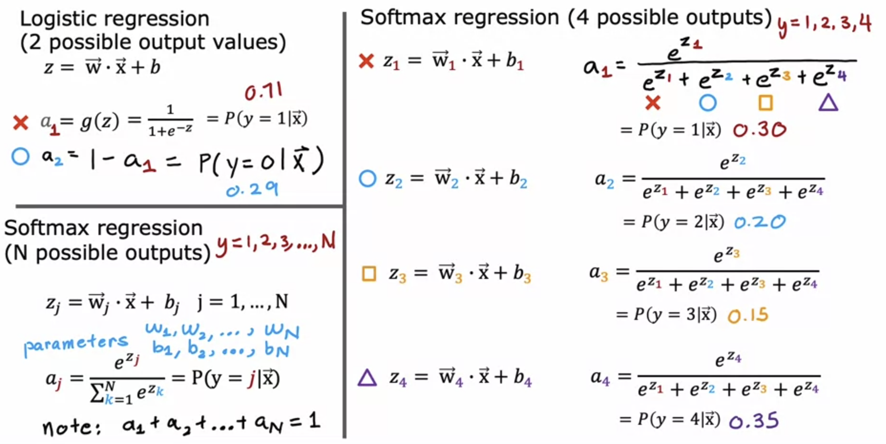
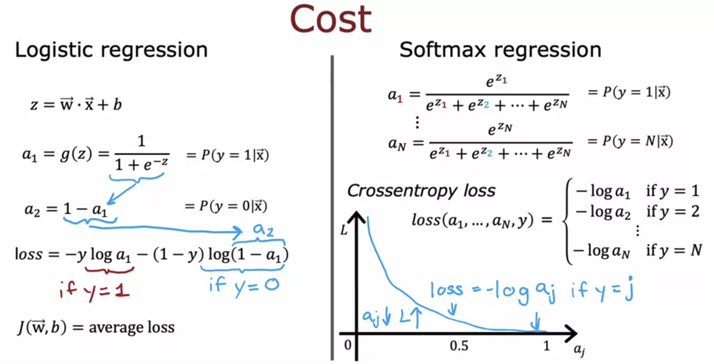
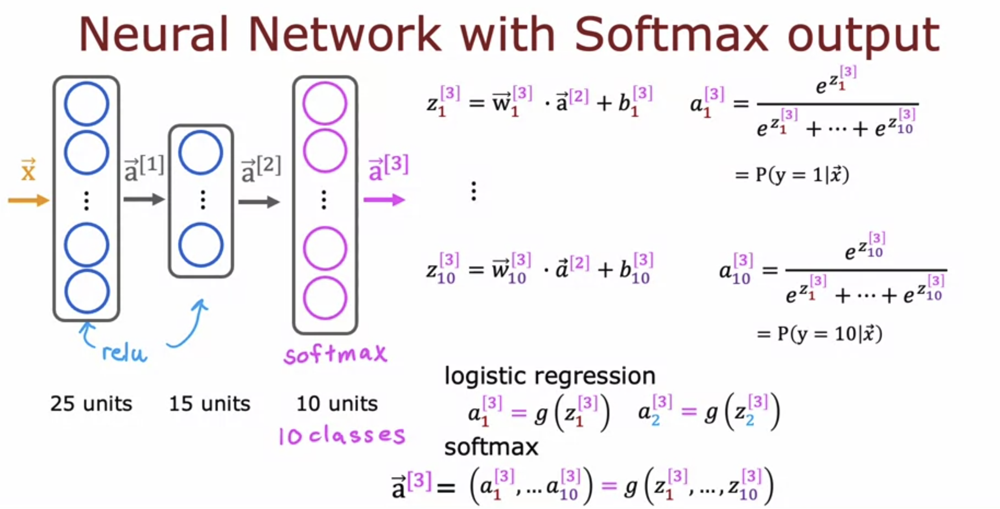
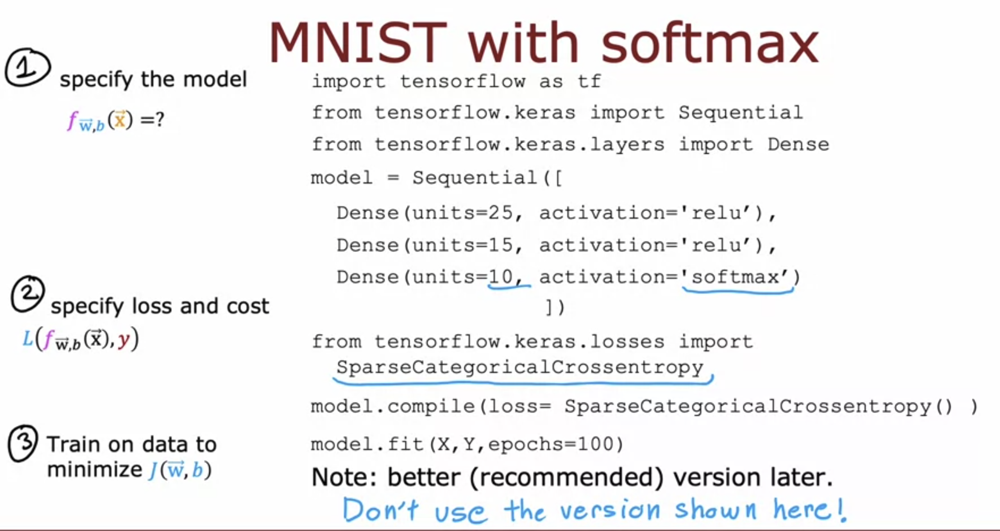
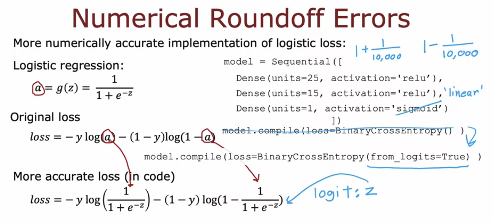
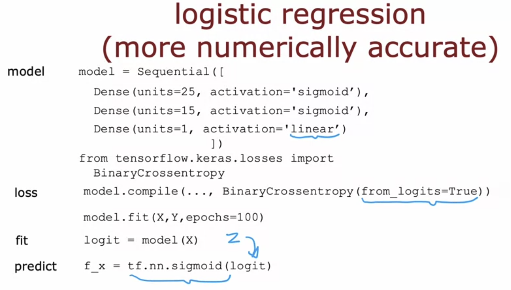
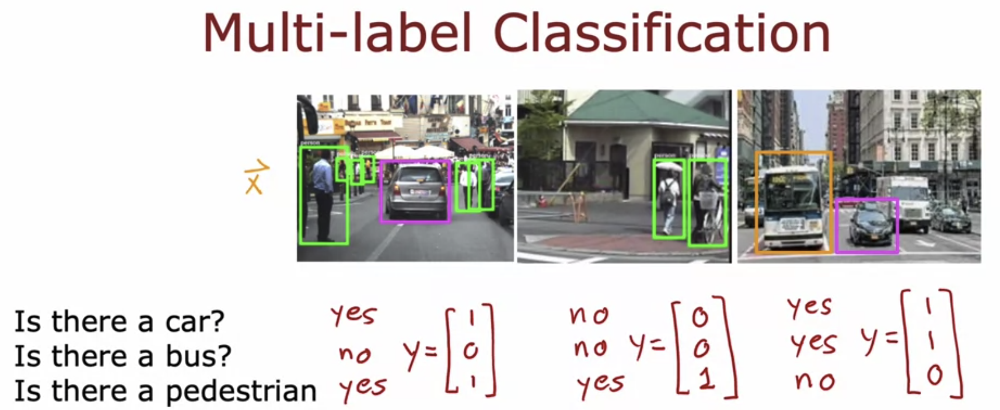
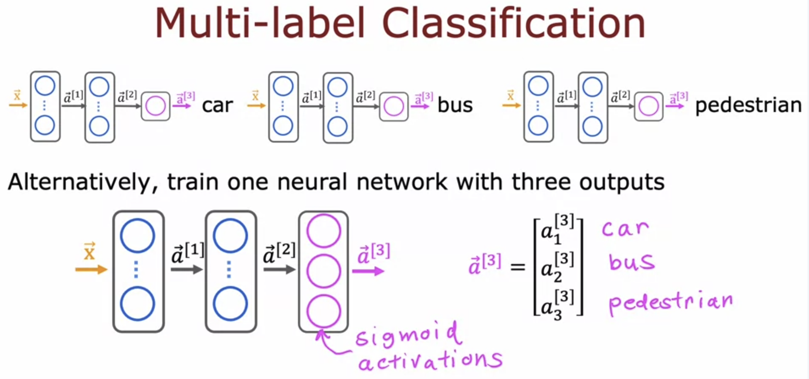

# Multiclass Classification

Multiclass Classification refers to classification problems where one can have more than two possible output labels ( not just 0 or 1 ). 

## Softmax Regression  

Softmax Regression is a generalization of the Logistic Regression ( which works only in binary classification ) to multiclass classification.  

**The Softmax Loss is known as SparseCategoricalCrossentropy in Tensorflow.**  

## Neural Network with Softmax Output

In the previous example of neural networks, the output layer had only one unit. But in multiclass classification problems, we need the activation of all the units. Hence, the output layer has softmax activation. 

In other activation functions, a_n used to only be a function of z_n.  
But now in softmax activation, a_n depends on all z_1, z_2, ... z_n. 

## Implementing in Code with Tensorflow

>[!NOTE]
A better more optimized version is available, don't use this

### Numerical Round Off Errors

Due to floating point precisions in code, there exists a small numerical round off error loss. This can be avoided if we directly put the value of a in the loss function instead of first calculating it in a variable. This allows tensorflow to make calculation optimizations by rearranging terms which reduces the errors. 

**This is achieved in code by setting from_logits=True and in the loss function parameter and activation='linear' in the output layer dense function.**

What this does is make the output layer activation function linear instead of sigmoid, and puts the sigmoid function in the loss itself.  

>[!IMPORTANT]
**Since now in the final layer, we are inputting z instead of a ( as the activation is linear and not sigmoid ), the output will also be z instead of a. Hence, we have to calculate a by taking sigmoid of z in the end.**

>[!NOTE]
**The Errors are negligible in Logistic Regression, but not in Softmax. Hence we use from_logits=True in Softmax as it is numerically more accurate.**

## Multilabel Classification

In Multilabel Classification, associated with each image, there can be multiple labels ( multiple outputs y1, y2, ... )

Hence the target output y is a vector. 

One way to approach this is to create three seperate neural networks for the three predictions.

The better approach is to train one neural network with three outputs. 

>[!IMPORTANT]
**This is not to be confused with Multiclass Classification. In Multiclass classification, all the output activations sum up to 1, that is, they are dependent on each other. If the digit is a 2, then it cannot be a 5 at the same time.  
But in multilabel classification, all the output values are independent of each other. The image might contain a car, a bus and a pedestrian all at once.  
Hence, Softmax Regression is not applicable here. Instead we proceed with normal Logistic Regression with sigmoid activation.**  

>[Softmax](../labs/Course%202/Week%202/C2_W2_SoftMax.ipynb)

>[Multiclass](../labs/Course%202/Week%202/C2_W2_Multiclass_TF.ipynb)

