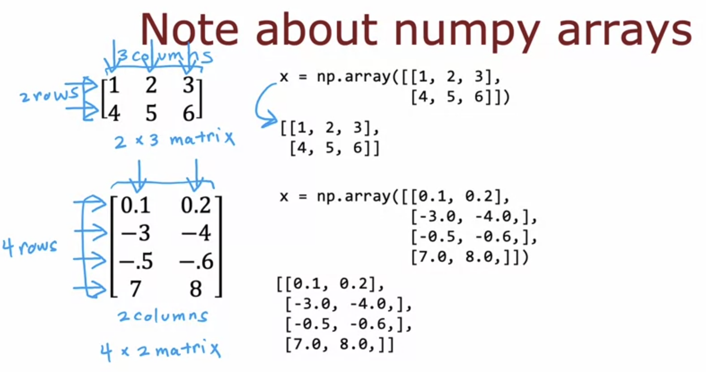
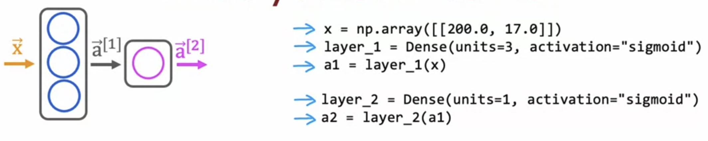
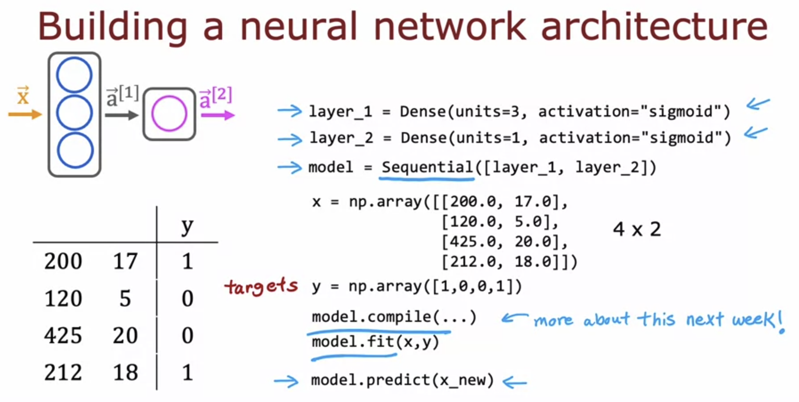

# Implementing Neural Networks in Tensorflow

**Here, the 2D Numpy Array represents a matrix, with each list in the outer list representing a row of the matrix, and the number of elements in the inner list representing the number of columns.**

**A Normal 1D Array like np.array([200, 17]) represents a vector not a matrix.**

>[!IMPORTANT]
**In Tensorflow, data is represented by matrices (2D arrays) and not by vectors.**

Now, instead of manually providing the inputs x and a1 to the layers, we can sort of bind the layers using Sequential(), so it will automatically provide the activation ( output ) of the previous layer to the next. 

model.predict() is used to carry out forward propagation.

>[Implementing Neural Networks in Tensorflow](../labs/Course%202/Week%201/C2_W1_Lab02_CoffeeRoasting_TF.ipynb)

