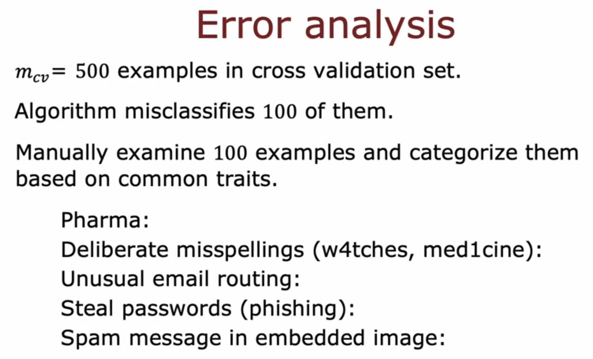
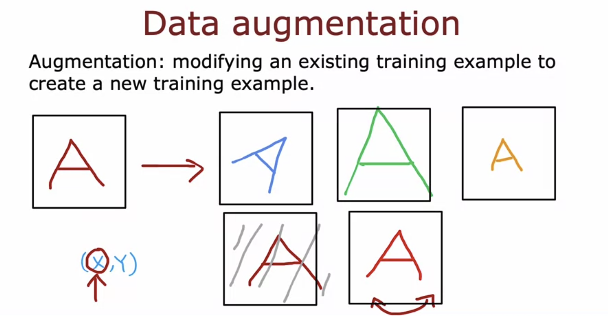
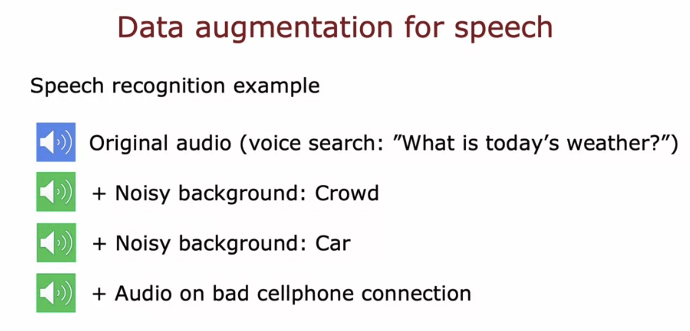
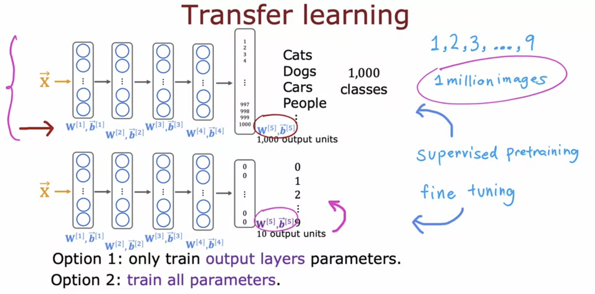
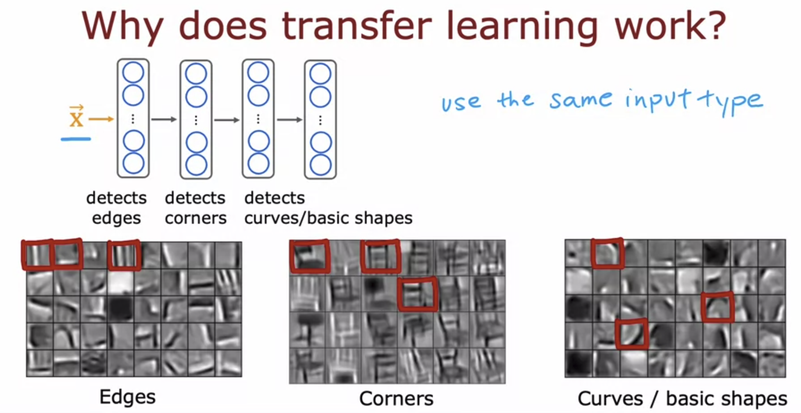

# Adding Data and Transfer Learning

When we need to add more training data, instead of adding more data of everything, first performing error analysis and adding that specific data is more effective.

For Example, if the algorithm misclassifies 100 examples out of 500, we can manually classify the 100 examples and find out what category they belong too. So if majority of the 100 misclassified examples are of unusual email routing category, then adding more data of that type is better. 

## Data Augmentation

Instead of getting brand new training examples, we can use the Data Augmentation technique to create new examples by modifying the inputs of existing examples ( keeping the output same ). 

We can also add distortions to the existing data to create new data

## Transfer Learning

Transfer Learning means using data ( parameters ) from a different task to perform your task. 

We use the model that has 1000 output units to perform our task which suppose has 10 output units, so we need to change the parameters of the output layer. 

The first option is to copy the parameters of all layers except output layer and then run gradient descent/adam's optimization to calculate the output layer parameters. This works nicely on a small training set. But on a large training set, the second option is used.   
The second option is to train the parameters of all layers, but initializing them with the parameters of the original model. 

The algorithm is called transfer learning ​because the intuition is by learning to recognize cats, ​dogs, cows, people, and so on, ​It will hopefully, have learned ​some plausible sets of parameters ​for the earlier layers for processing image inputs.  
​Then by transferring these parameters ​to the new neural network, ​the new neural network starts off with the parameters in ​a much better place so ​that we have just a little bit of further learning. ​Hopefully, it can end up to be a pretty good model. ​ 

Suppose the first layer of the original neural network learns to detects edges in an image, the second layer learns to detect corners, and the third layer learns to detect curves/basic shapes, and the final output layers detects whether the image is of a cat/dog/car etc. Then by transferring the layers except the output layer, we can transfer those learnings into our neural network which might perform some other task ( like digit recognition ).

The Input type must be same, transferring the parameters from an Image Classification Model and use it for Speech Recogntion is of no use. 

