# Bias and Variance

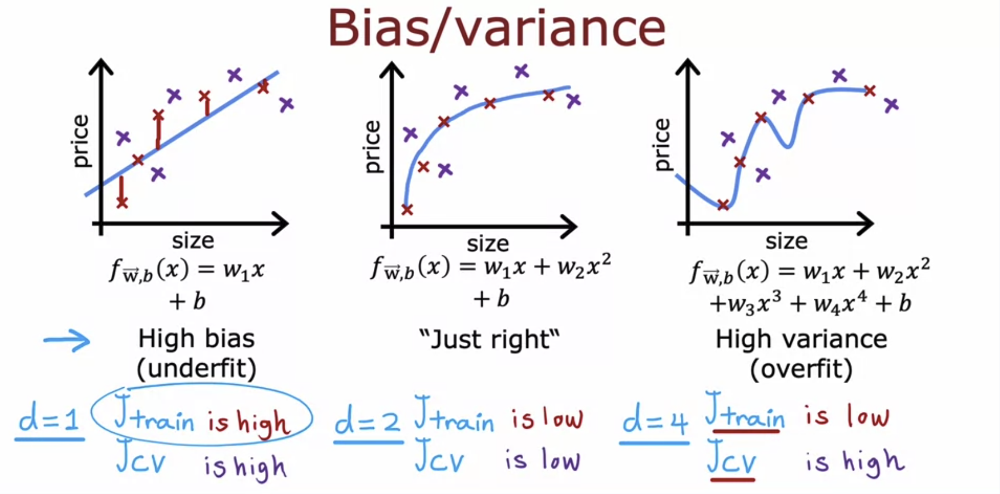

Bias and Variance have a tradeoff, where if you build a simple model, it has high bias, and if you build a complex model, it has high variance. Our task is to build a model with optimal bias and variance which is the perfect balance of both. 

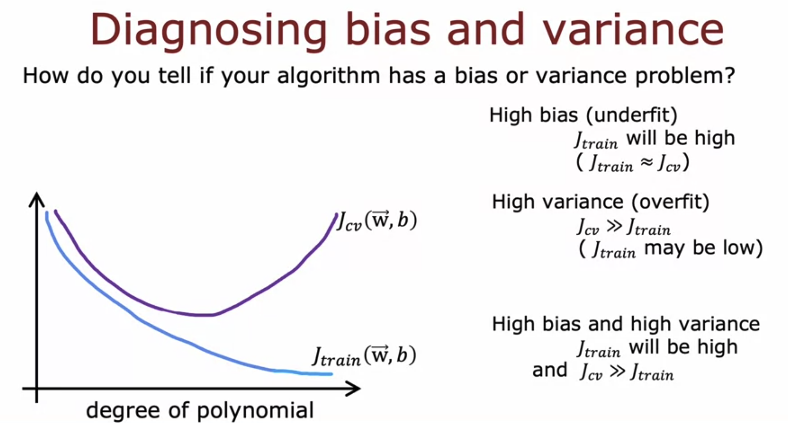

## Regularization

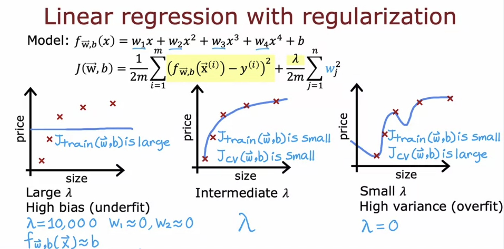

Large Lambda leads to very small parameters, hence the model will underfit ( high bias ). Small Lambda means parameter will have negligible changes hence the model will be as it is ( overfit ). 

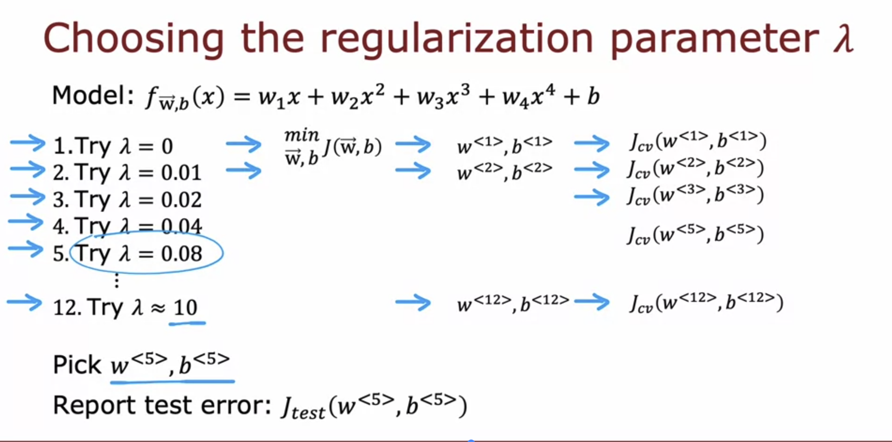

The regularization parameter is chosen the same way as we choose the degree of the model. We pick the value of lambda with the minimum crossvalidation cost, and estimate the generalization error by finding the test error on that value. 

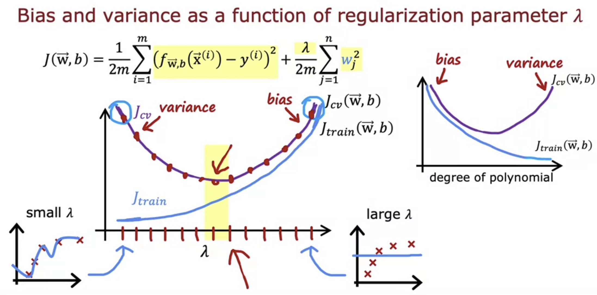

The graphs of lambda and degree of polynomial are like mirror images. 

## Baseline Performance

Suppose on a speech recognition model, if the training error is 10.8%, and the crossvalidation error is 14.8%. Then we consider the model as high bias ( underfit ).  
But what if the human level performance on that dataset is 10.6%. Then the difference between the model training error and the human error is just 0.2%. The difference between training error and crossvalidation error is still 4%. Hence, the model is considered high variance ( overfit ). 

Hence, whether the training error is high or low is estimated by comparing it with a baseline performance, which may be human level performance, or other competing algorithms performance, or even a guess based on experience. 

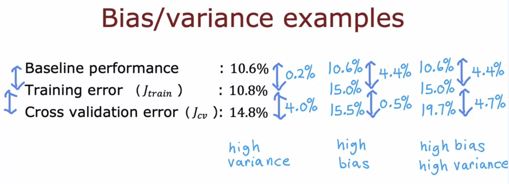

## Learning Curves

Learning curves are a way to understand how well the learning algorithm is doing as the function of the amount of training examples. 

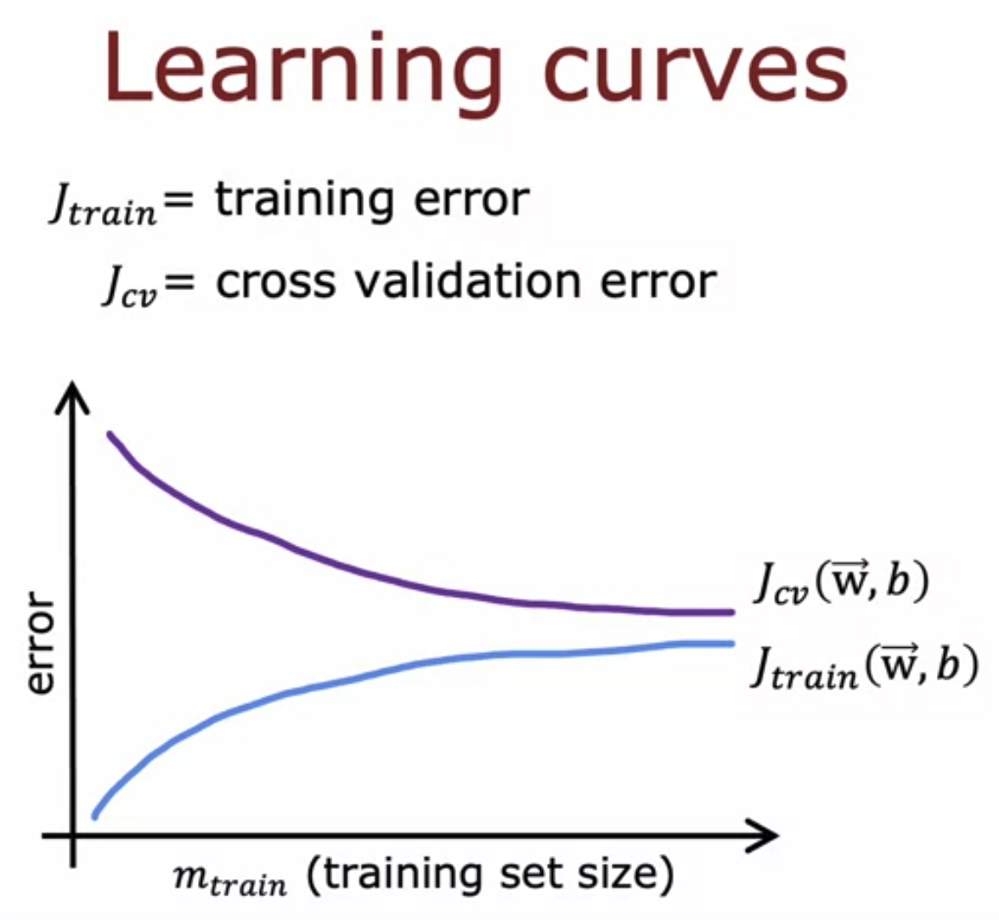

The training error increases as the size of training set increases, because it becomes harder and harder to fit all the values in a single curve.  
The cross validation error decreases as the size of training set increases, because the model becomes better at predicting.  
The cross validation error is generally always higher than the training error, since it has new values to predict.  

### High Bias

As the number of training examples increases, the curve eventually flattens since the parameters stop changing at one point even if you get more examples.

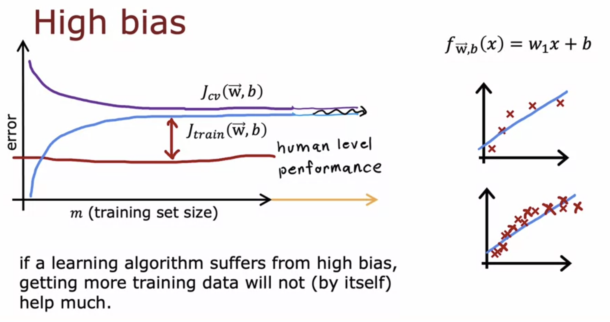

**The difference between the training error and human level performance gives away that the model has high bias.** 

**In this case, getting more training data will not help.** 

### High Variance

**Here, the training error is less than the human level performance, i.e. the model fits the training data very accurately, but the difference between cross validation error and training error is high. This gives away that the model is high variance.** 

As the number of training examples increases, the difference between the training and cross validation errors decreases. 

**In this case, getting more training data is likely to help.** 

## Debugging a Learning Algorithm

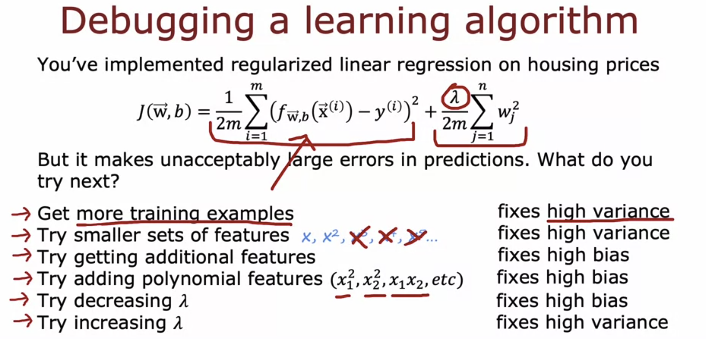

## Neural Networks

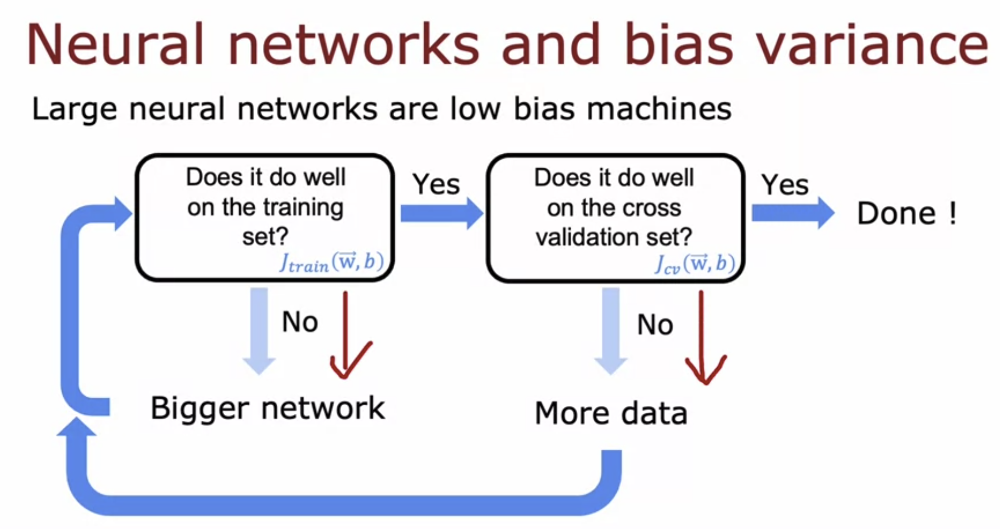

A large neural network will usually do as well or better than a smaller one as long as the regularization is done appropriately.

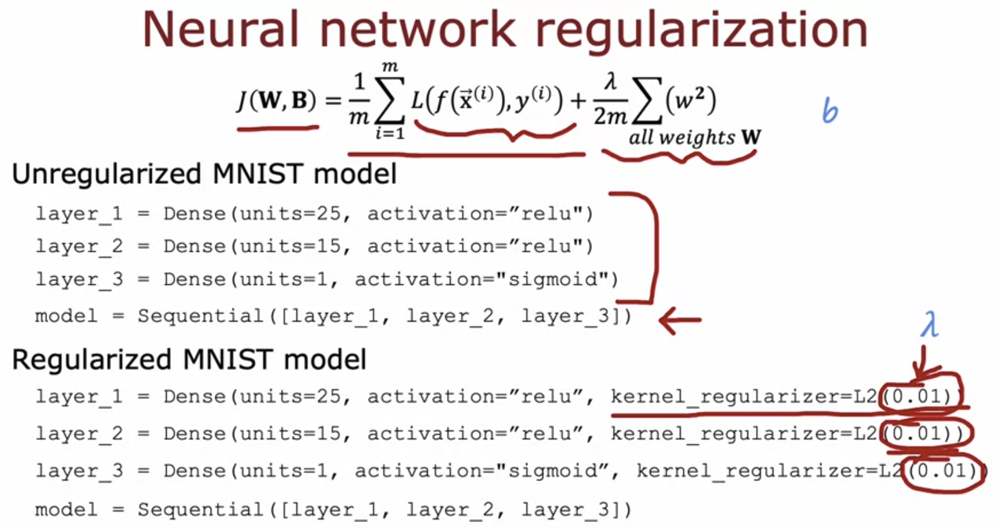