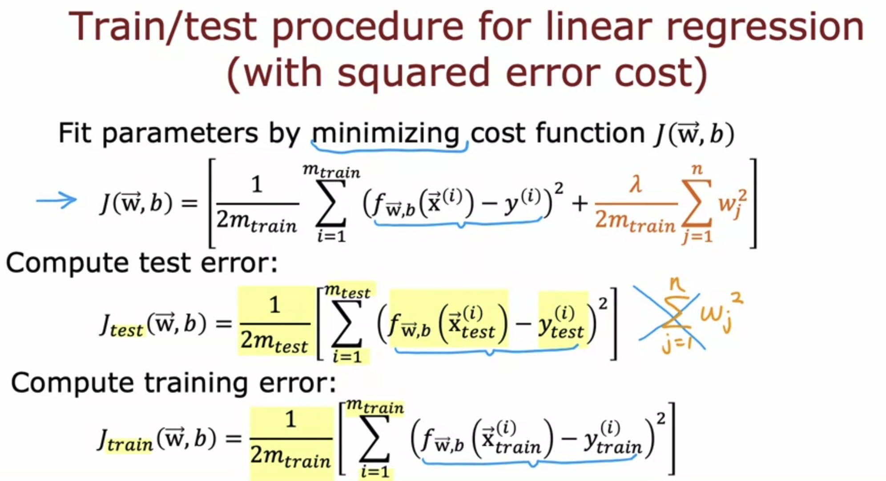
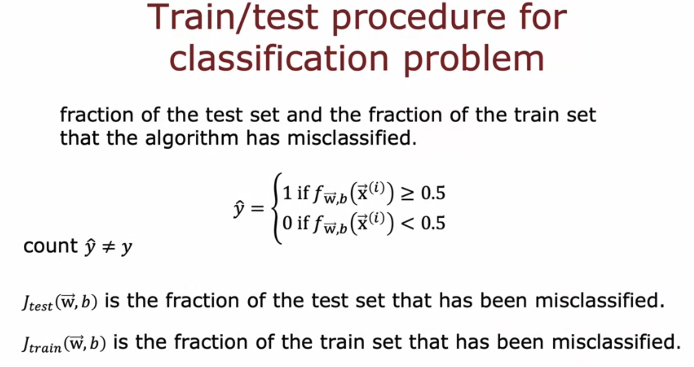
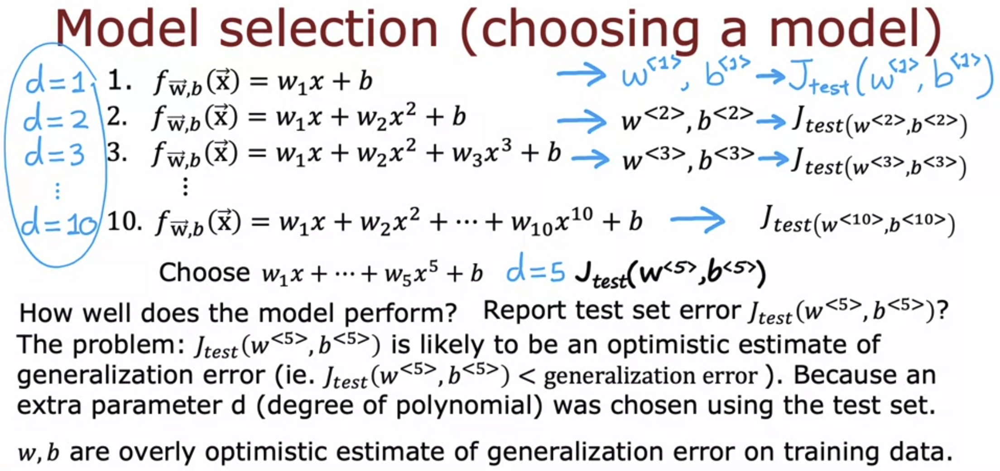
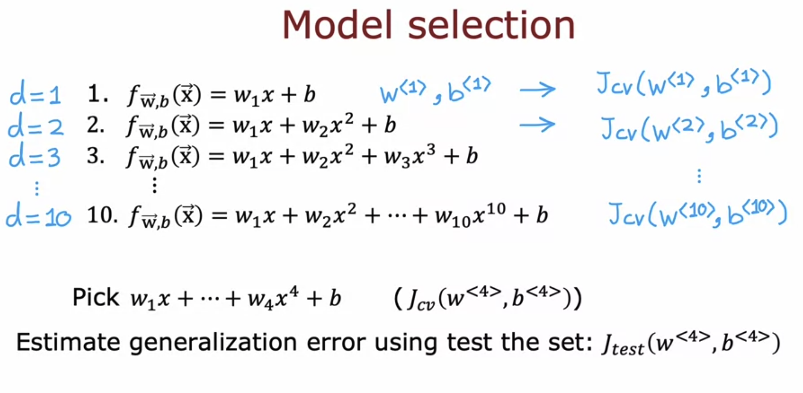

# Evaluating and Choosing Models

In order to evaluate a model, the original dataset is split into training and test set. 

The regularization term is present only while training the function and not while computing the errors. 

Instead of calculating the training and test errors separately, we can find the error by finding the fraction of the set that has been misclassified.   

Once the parameters are fit to the training set, the training error is likely to be less than the actual generalization error.  
Hence the testing error is a better estimate of how well the model will generalize to new data.  

## Choosing a Model

To choose which degree model to use, one can calculate the testing error for each degree and choose the model with the lowest testing error. But since we have used the testing set now in our model in order to determine the degree, it is now flawed and considered optimistic ( not completely random ). The error on any new data ( generalization error ) will be greater than the testing error. 

Hence, what we do is split the dataset into three parts ( instead of two ), the Training Set, Test Set, and Cross Validation set.

The Cross Validation Set is used to crosscheck the accuracy of the model. It is also known as validation set or development set.  

**The models are trained using the training set, the degree using the cross validation set ( by picking the model with the minimum cross validation error ), and the generalization error is estimated using the testing set.**  

>[Model Evaluation and Selection](../labs/Course%202/Week%203/C2W3_Lab_01_Model_Evaluation_and_Selection.ipynb)