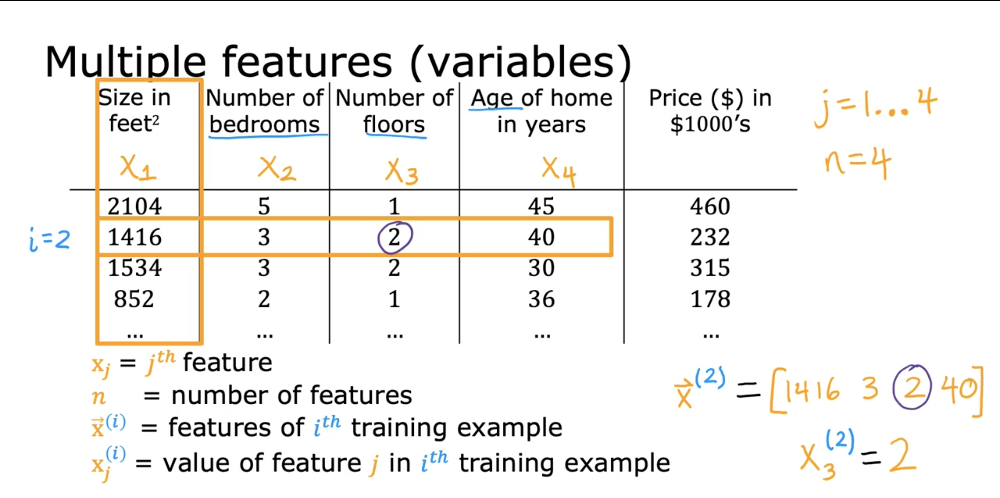
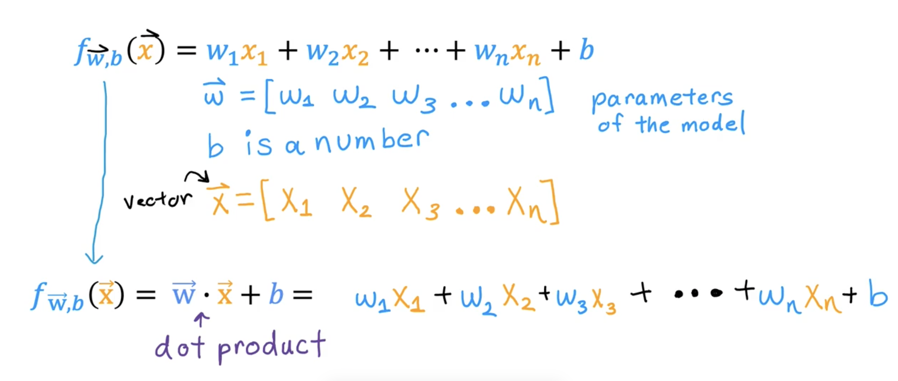
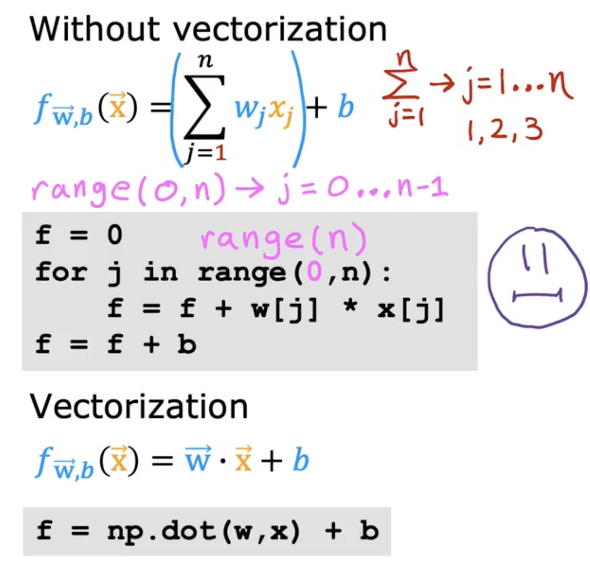
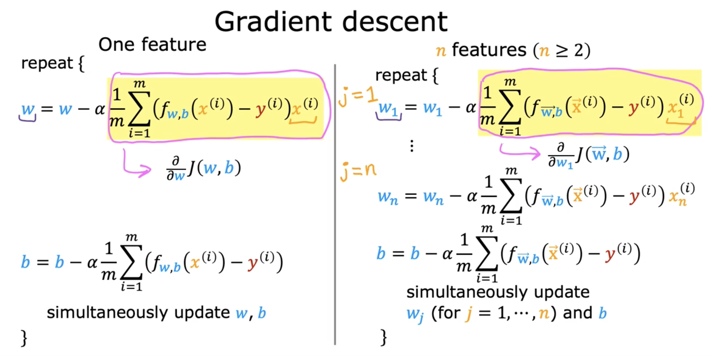

# Multiple Linear Regression and Vectorization

## Cost Function for Linear Regression with multiple features

## Vectorization

The w and x are represented as vectors ( stored as numpy arrays in code ), which makes calculations easier and also faster.

>[NumPy and Vectorization](../../labs/Course%201/Week%202/C1_W2_Lab01_Python_Numpy_Vectorization_Soln.ipynb)

## Gradient Descent for Multiple Linear Regression

>[!NOTE]
Normal Equation is an alternative method for finding w and b ( only for linear regression ).  
This other method does not need an iterator like gradient descent algorithm. Some disadvantages of the normal equation method are; first unlike gradient descent, this is not generalized to other learning algorithms. The normal equation method is also quite slow if the number of features is large. Almost no machine learning practitioners should implement the normal equation method themselves but if you're using a mature machine learning library and call linear regression, there is a chance that on the backend, it'll be using this to solve for w and b. 

>[Implementing Gradient Descent In Code](../../labs/Course%201/Week%202/C1_W2_Lab02_Multiple_Variable_Soln.ipynb)

