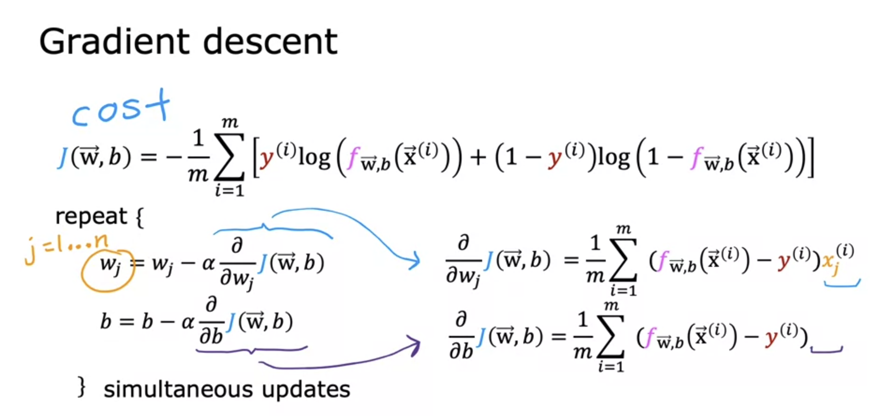
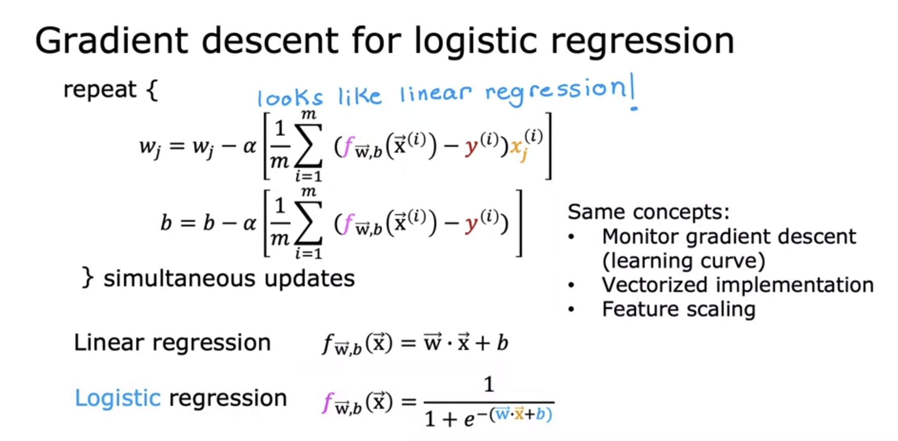

# Gradient Descent in Logistic Regression

>[!NOTE]
The Derivative Term looks the same as that in linear regression. But note that the definition of the function f is different in linear and logistic regression.

>[Gradient Descent for Logistic Regression](../../labs/Course%201/Week%203/C1_W3_Lab06_Gradient_Descent_Soln.ipynb)

>[Logistic Regression with scikit-learn](../../labs/Course%201/Week%203/C1_W3_Lab07_Scikit_Learn_Soln.ipynb)