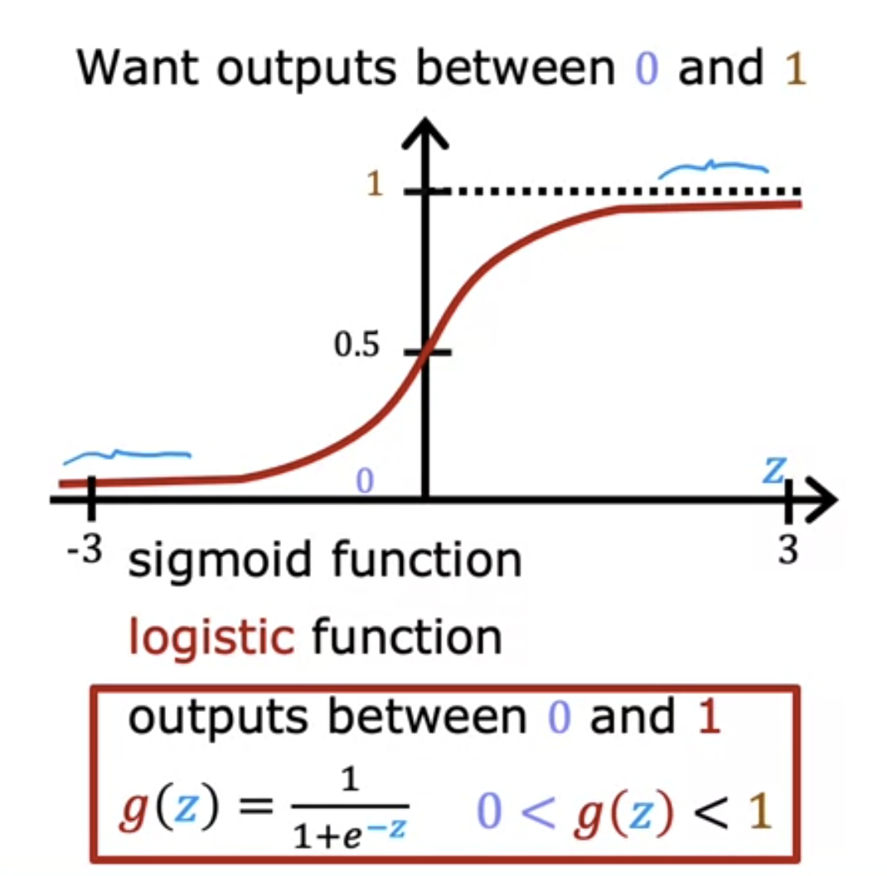
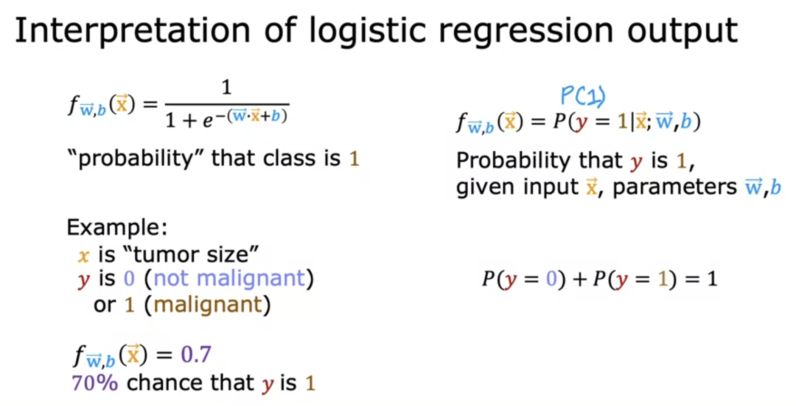
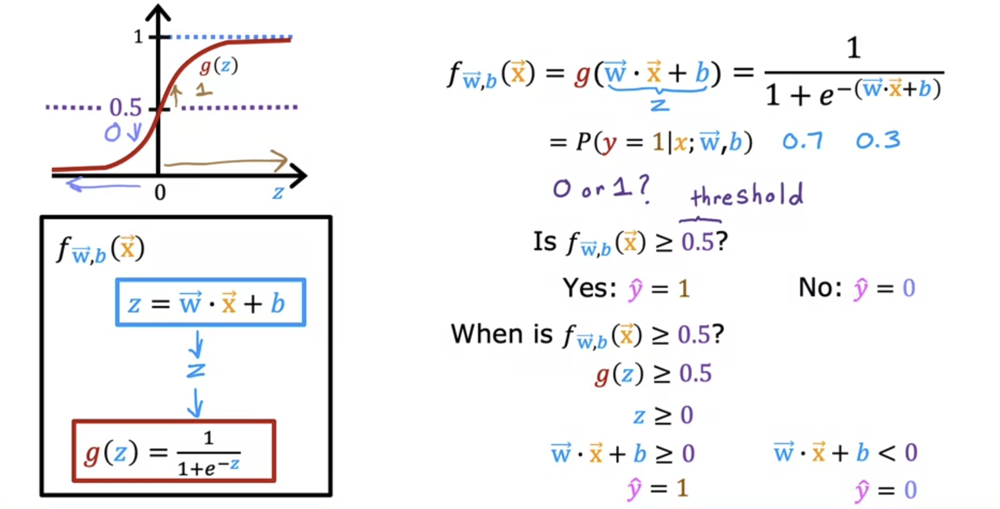

# Introduction to Logistic Regression

We saw that ​linear regression is not ​a good algorithm for this problem. ​In Logistic Regression we end ​up doing is fit a ​S-shaped curve to this dataset. 

​To build out to the logistic regression algorithm, we need to use the Sigmoid function, ​sometimes also referred to as the logistic function. 

## Sigmoid Function

**​The Sigmoid function denoted by g(z) outputs value is between 0 and 1.**   
z is the input of the sigmoid function which is different from the input feature x.  
If z tends to positive infinity, the sigmoid function outputs 1, and if z tends to negative infinity, it outputs 0. If z is 0, the value of sigmoid function is 0.5

## Logistic Regression Model

We consider the value of z to be wx+b and pass it to the Sigmoid Function, ​also called the logistic function.

​This is the logistic regression model, ​and what it does is it inputs feature or set ​of features X and outputs a number between 0 and 1. 

>[Sigmoid Function and Linear Regression](../../labs/Course%201/Week%203/C1_W3_Lab02_Sigmoid_function_Soln.ipynb)

## Decision Boundary

We consider the prediction to be 1 when f(x)>=0.5 and 0 when f(x)<=0.5 .
For f(x) to be greater than 0.5, z should be greater than or equal to 0.

Hence, **Decision Boundary is the function representated by z=0.
On one side of the decision boundary, the model will have a positive result, while on the other side there will be a negative result.**

For Example, in Linear Function z = wx+b, we get wx+b=0 line as Decision Boundary. There might be cases where z might have powers of x ( polynomial regression ) in which case the decision boundary will be non-linear.

>[Decision Boundary](../../labs/Course%201/Week%203/C1_W3_Lab03_Decision_Boundary_Soln.ipynb)

