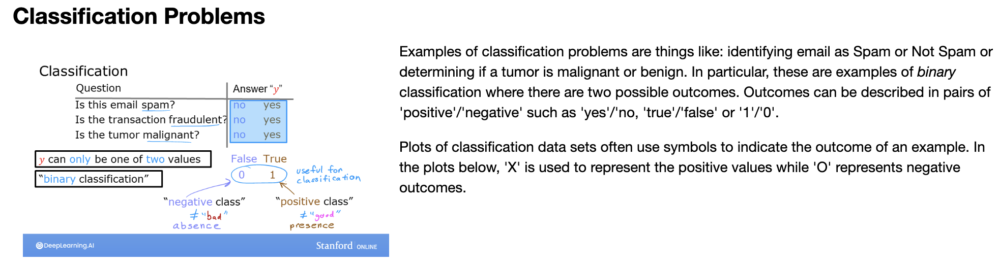

# Why Linear Regression is not used in Classification Problems

Taking example of a training set for classifying if the tumor is malignant using linear regression. Plotting the tumor size on the horizontal and the label Y on the vertical axis, where Y=1 represents the tumor is malignant. 

We apply ​Linear regression and try to fit a straight line to the data. But ​Linear regression predicts not just the values zero and one. ​But all numbers between zero and one or even less than zero or greater than one. ​But here we want to predict categories. ​One thing we could try is to pick a threshold of 0.5. ​So that if the model outputs a value below 0.5, ​then predict y=0 or not malignant. ​And if the model outputs a number equal to or ​greater than 0.5, then predict y=1 or malignant. 

​Notice that this threshold value of 0.5 intersects ​the best fit straight line at a point. ​So if you draw this vertical line there, ​everything to the left ends up with a prediction of y=0 and everything on the right ends up with the prediction of y=1. This vertical line is called the decision boundary 

​But what if the dataset has one more training example way over here on the right. This training example shouldn't really change how you classify ​the data points. ​The vertical dividing line that we drew still makes sense as the cut off ​where tumors smaller than this should be classified as zero. ​And tumors greater than this should be classified as one. 

​But once we have added this extra training example on the right. ​The best fit line for linear regression will shift over to the right to cover that example. ​And if we continue using the threshold of 0.5, we now notice ​that everything to the left of this point is predicted as y=0, and everything to the right of this point is predicted to be one or malignant. ​

This isn't what we want because adding that example way to the right shouldn't ​change any of our conclusions about how to classify malignant versus benign tumors. ​But if qw try to do this with linear regression, ​adding this one example ends up with us learning a much worse function for this classification problem. 

Hence, we do not use linear regression for classification problems. Instead we use Logistic Regression. Even ​though it has the word of regression in it is actually used for classification. ​It's actually used to solve binary classification problems ​with output label y is either zero or one. 

>[Classification with Linear Regression](../../labs/Course%201/Week%203/C1_W3_Lab01_Classification_Soln.ipynb)