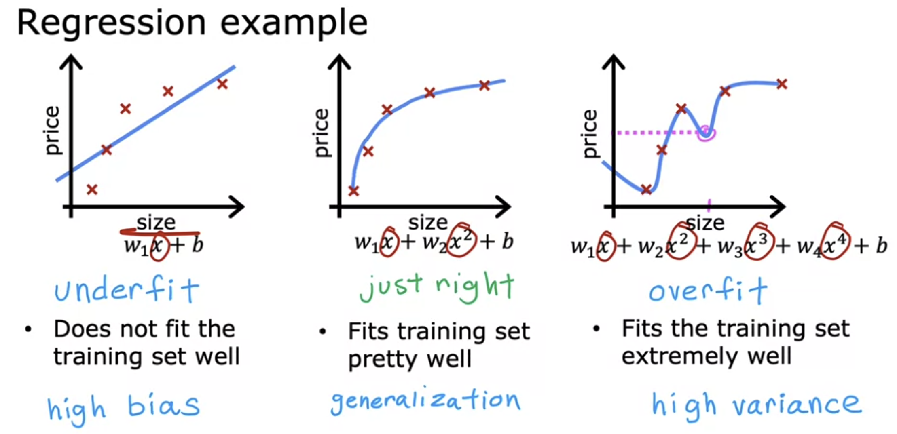
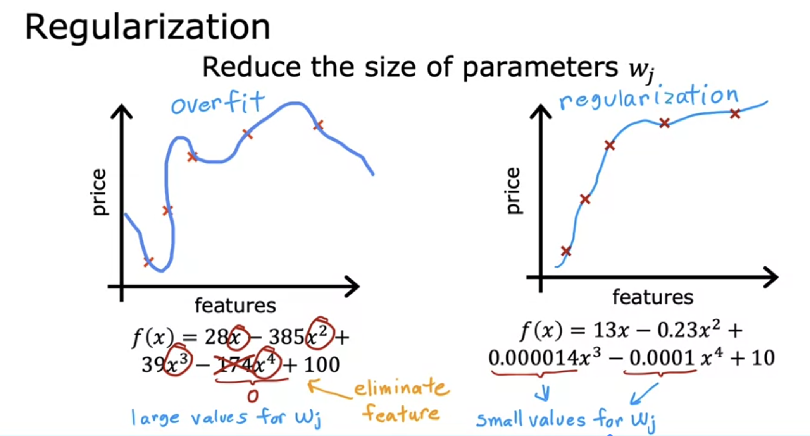
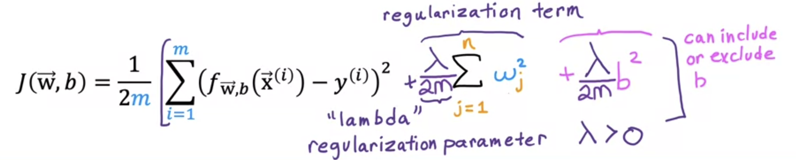
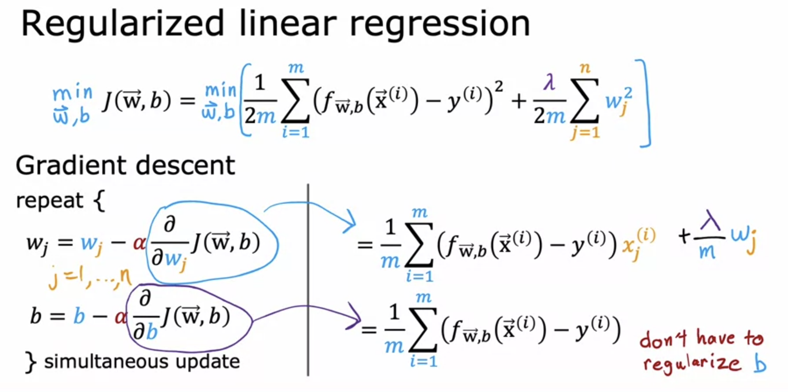
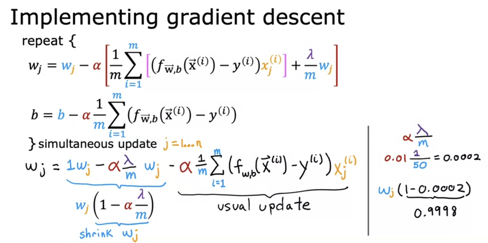
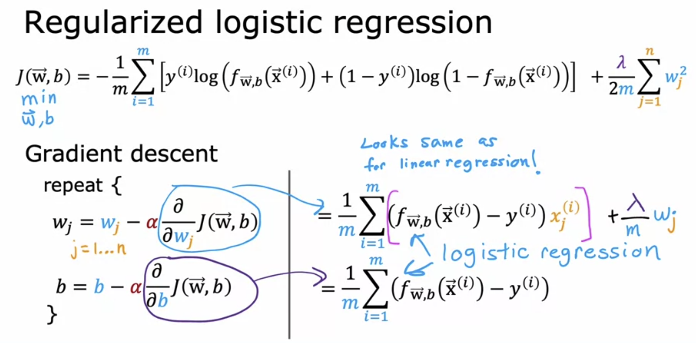

# The Problem of Overfitting and Regularization

When a model does not fit the training data well, it is said to be underfit, or a high bias model.   
When it fits the data pretty well, it is said to be a generalized model.  

Sometimes, the model uses a very complex function in order to fit the training data perfectly. Even though it fits the given data, and the cost function might even be zero, but it is not a good model, since it might not be able to predict on new data. This is called overfitting. Such a model is also called a high variance model. 

One way to prevent overfitting is to use a larger training set i.e. correct more training examples, which helps in generalizing the model.  
Another option is to reduce the number of features ( especially polynomial ). The downside of reducing features is that it leads to data loss

>[Overfitting](../labs/Course%201/Week%203/C1_W3_Lab08_Overfitting_Soln.ipynb)

## Regularization

Regularization is used to prevent overfitting. Instead of reducing the features ( i.e. setting their parameters directly to 0 ), it instead reduces the size of the parameters which previously have a larger value. So it prevents the features from having an overly large effect. 

In regularization, we generally reduce the parameters w1, w2, .. wN, and not generally b.

### Cost Function with Regularization

We do not know which parameters to reduce for regularization, so we penalise all the parameters ( reduce their effect ) by adding an extra term called regularization term in the cost function. 

Including the b term does not make much of a difference, so in practice, it is generally excluded.

Since the goal is to minimize the cost, in order to minize the cost, gradient descent will automatically also appropriately reduce the values of the parameters due to the added regularization term

**When lambda=0, the regularization term has no effect, so the model will overfit.  
When lambda is too large,the only way to minimize the cost function is to set the values of all parameters very close to 0. Hence f(x)=b, which is a horizontal straight line that underfits.**  
Hence choosing an appropriate value of lambda is very important, just like choosing alpha.

### Regularized Linear Regression

We get an extra term in the cost function derivative here

Since the value of alpha*lambda is very small, this leads to an added small decrement of w_j on each iteration.

### Regularized Logistic Regression

>[Regularization](../labs/Course%201/Week%203/C1_W3_Lab09_Regularization_Soln.ipynb)