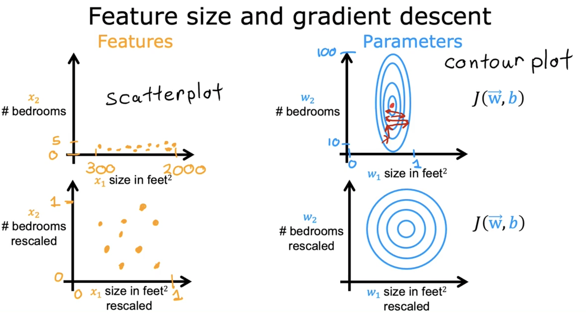
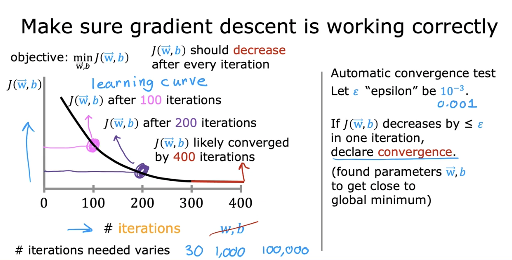
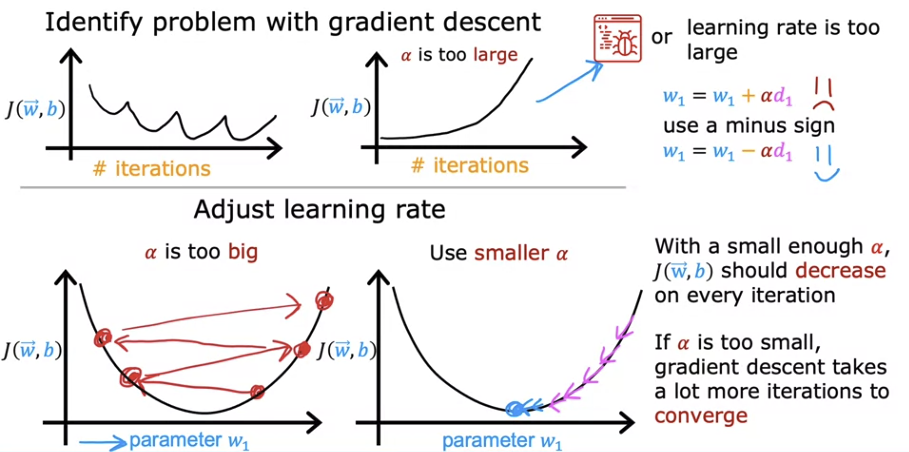

# Feature Scaling, Checking Gradient Descent for Convergence and Choosing an appropriate Learning Rate

## Feature Scaling

Feature Scaling is a technique that enables gradient descent to run much faster. 

For Ex) While predicing the price of a house using two features x1 the size of the house and x2 the number of bedrooms. Let's say that x1 typically ranges
from 300 to 2000 square feet. And x2 in the data set
ranges from 0 to 5 bedrooms. So for this example, x1 takes on
a relatively large range of values and x2 takes on a relatively
small range of values. 

We notice that when a possible range of values of a feature is large, like the size and square feet which goes all the way up to 2000, It's more likely that a good model will learn to choose a relatively small parameter value, like 0.1.   
Likewise, when the possible values of the feature are small, like the number of bedrooms, then a reasonable value for its parameters will be
relatively large like 50. 

>[!IMPORTANT]
**When the range of values of a feature is large, its respective parameter is observed to be small and vice versa.**

And this is because a very small change to w1 can have a very large impact on the estimated price and that's a very large impact on the cost J. Because w1 tends to be multiplied by a very large number, the size and square feet. In contrast, it takes a much larger change in w2 in order to change the predictions much. And thus small changes to w2, don't change the cost function nearly as much. 

This is what might end up happening if we were to run gradient descent, in this training data as it is. **Because the contours are so tall and skinny gradient descent may end up bouncing back and forth for a long time before it can finally
find its way to the global minimum.**

**In situations like this, a useful thing to do is to scale the features. This means performing some transformation of your training data so that x1 say might now range from 0 to 1 and x2 might also range from 0 to 1. The key point is that the scale of x1 and x2 are both now in comparable ranges of values to each other. And if you run gradient descent on this rescaled transformed data, then the contours will look more like this more like circles and less tall and skinny. And gradient descent can find a much more direct and faster path to the global minimum.**

### Ways to implement feature scaling

1. **Divide by Highest Value of the feature, so the upper bound is always 1**  
Ex) If x1 ranges from 3-2000, divide by 2,000, the maximum of the range. 
Now x1 will range from 0.15 up to 1. Similarly, since x2
ranges from 0-5, dividing by 5, x2 will now range from 0-1.

2. **Mean Normalization**  
Replace every element x1 with: **(x1-mean) / (upperbound-lowerbound)**  
The ranges will always be from -1 to 1 now

For Ex) If 300<=x1<=2000, and the average is 600, after mean normalization, -0.18<=x1<=0.82

3. **Z-score Normalization** 

To implement z-score normalization, first we need to calculate standard deviation ( denoted by sigma )

Replace every element x1 with: **(x1-mean) / standard deviation**

As a rule of thumb, when performing feature scaling, you might want to aim for getting the features to range from around -1 to +1 for each feature x. 
But these values, negative one and plus one can be a little bit loose. If the features range from negative three to plus three or negative 0.3 to plus 0.3, all of these are completely acceptable.

## Checking Gradient Descent for Convergence

The job of gradient descent is to find parameters w and b that hopefully minimize the cost function J. Hence, the value of the cost function should decrease as the number of iterations increase. If this does not happen, then it means that the learning rate is choosen poorly ( too large ) or there is a bug in the code.

To observe this, we plot the value of J against the number of iterations, this graph is called the learning curve.

As we can see, after 300 iterations, the cost J is levelling off and is no longer decreasing much. By 400 iterations, the curve has flattened out ( converged ). This means gradient descent is now complete. 

Another way to decide when your model is done training is with an automatic convergence test. Let epsilon be a variable representing a small number, such as 0.001 or 10^-3. If the cost J decreases by less than this number epsilon
on one iteration, then you're likely on this flattened part of the curve that you see on the left and you can
declare convergence.

## Choosing an appropriate learning rate

The learning algorithm will run much ​better with an appropriate choice of learning rate. ​If it's too small, ​it will run very slowly and if it is too large, ​it may not even converge.  
If you ​plot the cost for a number of iterations ​and notice that the costs sometimes ​goes up and sometimes goes down, ​you should take that as a clear sign that ​gradient descent is not working properly. ​This could mean that there's a bug in the code. ​Or sometimes it could mean that ​your learning rate is too large.   

​Note that setting Alpha ​to be really small is meant here as ​a debugging step and a very small value of Alpha ​is not going to be the most efficient choice ​for actually training your learning algorithm. Because if the learning rate is too small, ​then gradient descents can take ​a lot of iterations to converge.

>[Feature Scaling and Learning Rate](../../labs/Course%201/Week%202/C1_W2_Lab03_Feature_Scaling_and_Learning_Rate_Soln.ipynb)