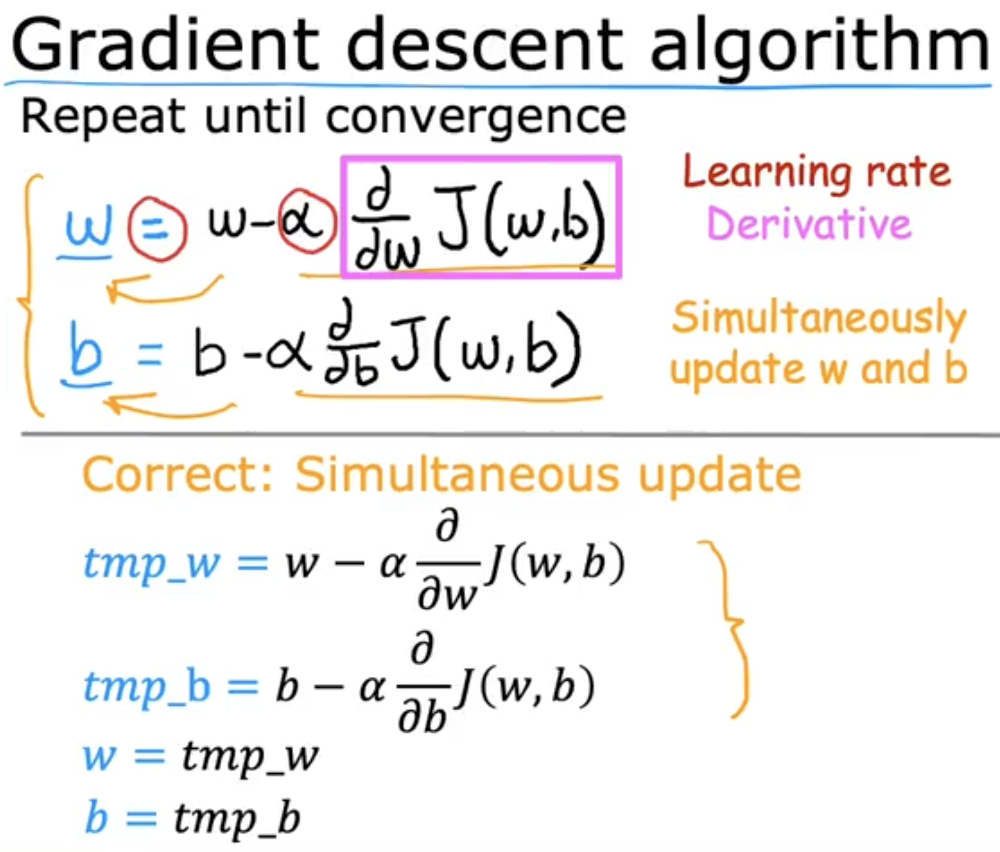
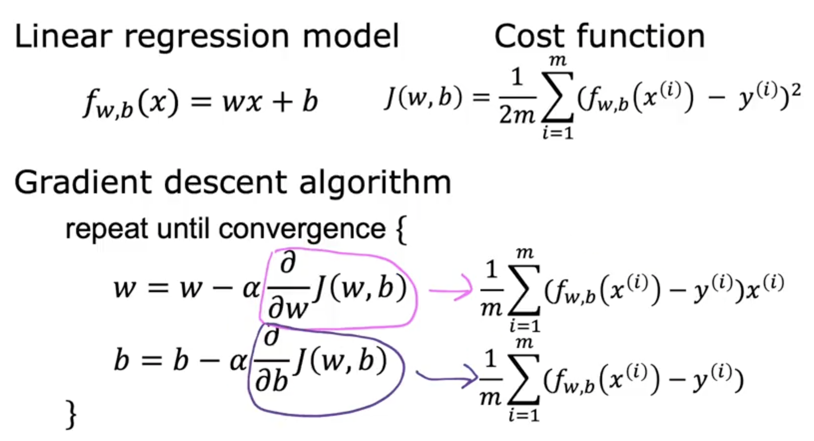

## Gradient Descent

**Gradient Descent Algorithm is ​a more systematic way to find the values of w and b, ​that results in the smallest possible cost, ​j of w, b.** 

Gradient Descent ​is an algorithm that you ​can use to try to minimize any function, ​not just a cost function for linear regression. It also ​applies to more general functions, ​including other cost functions that work ​with models that have more than two parameters.

Imagine you are up a valley and your goal is to get ​to the bottom as efficiently as possible. ​Mathematically, this is ​the direction of steepest descent. ​Remember that you can choose a starting point at ​the surface by choosing ​starting values for the parameters w and b. ​Now, imagine if you try gradient descent again, ​but this time you choose ​a different starting point by choosing different ​parameters and then repeat the process, ​then you might end up in a totally different minimum.

​The bottoms of both the first and ​the second valleys are called local minima. ​Because if you start going down the first valley, ​gradient descent won't lead you to the second valley, ​and the same is true if you ​started going down the second valley, ​you stay in that second minimum and ​not find your way into the first local minimum. ​This is an interesting property ​of the gradient descent algorithm.

A convex function ​is a bowl-shaped function and ​it cannot have any local minima ​other than the single global minimum.  
**A Squared Error Cost Function in Linear Regression is a convex function.**  
​When you implement gradient descent on a convex function, ​it will always converge to the global minimum.

>[Gradient Descent Code Implementation](../../labs/Course%201/Week%201/C1_W1_Lab05_Gradient_Descent_Soln.ipynb)