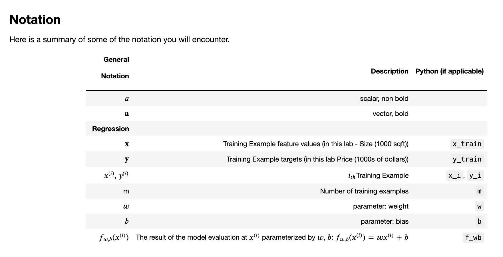
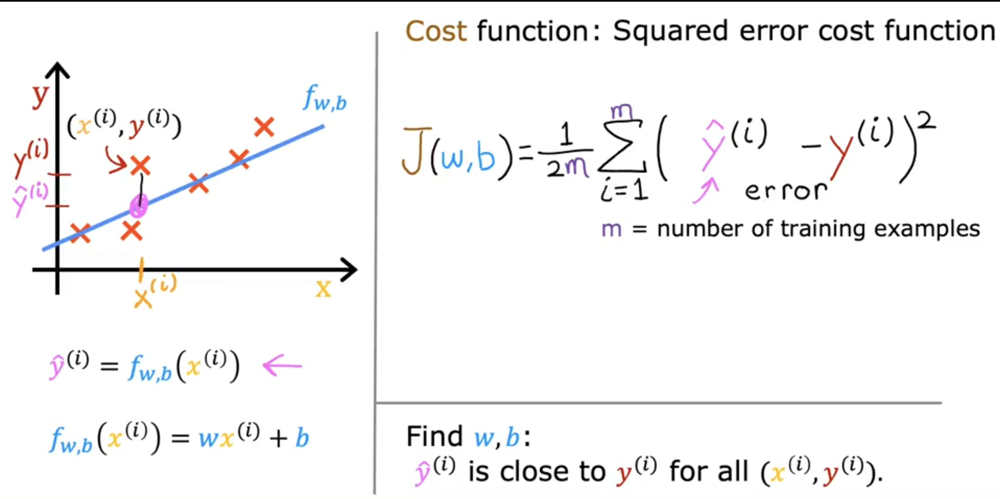
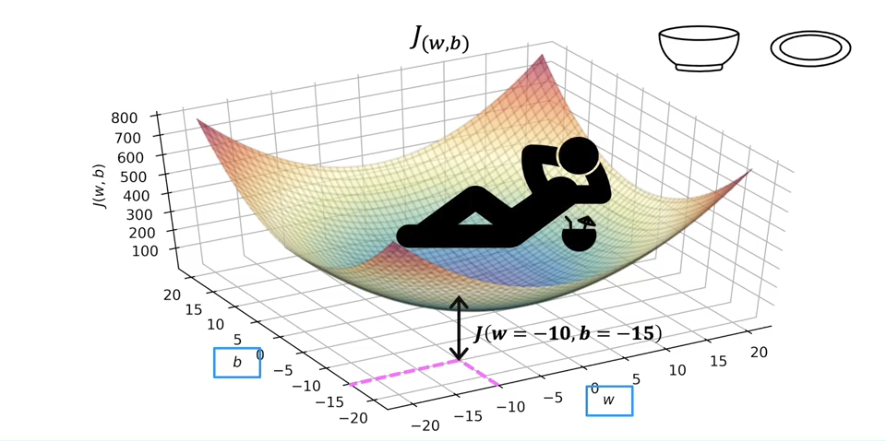
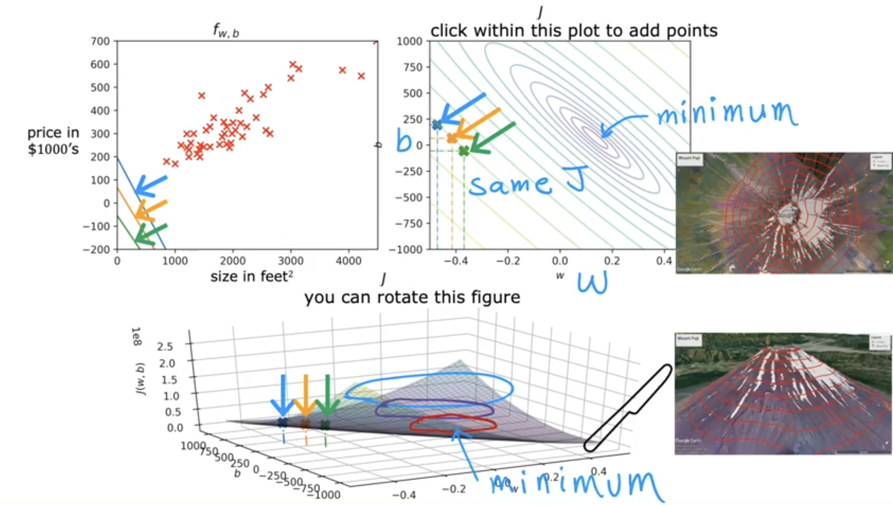

# Linear Regression

Linear Regression Model just means fitting a straight line to your data. ​It's probably the most ​widely used learning algorithm in the world today.

Taking an example of house price predicting model, a Training set in ​supervised learning includes both the input features, ​such as the size of the house and ​also the output targets, ​such as the price of the house. ​The output targets are ​the right answers to the model we'll learn from. **​To train the model, ​you feed the training set, ​both the input features and ​the output targets to your learning algorithm.** ​Then your supervised learning algorithm ​will produce some function. 

​We'll write this function as lowercase f, ​where f stands for function. ​Historically, this function used to ​be called a hypothesis. ​**The job of f is to take a new input ​x and output and estimate or a prediction, called y-hat**, written like ​the variable y with little hat symbol on top. 

**​In machine learning, the convention is that ​y-hat is the estimate or the prediction for y. ​The function f is called the model. ​X is called the input or the input feature, ​and the output of the model is the prediction, y-hat. ​The model's prediction is the estimated value of y.**

​When the symbol is just the letter y, ​then that refers to the target, ​which is the actual true value in the training set. ​In contrast, y-hat is an estimate. ​It may or may not be the actual true value. ​Your model f, given the size, ​outputs the price which is the estimator, ​that is the prediction of what the true price will be. ​Now, when we design a learning algorithm, ​a key question is, ​how are we going to represent the function f? ​Or in other words, ​what is the math formula we're going to use to compute f? 

​For now, let's stick with f being a straight line. ​You're function can be written as f w, ​b of x = wx + b. ​This ​means f is a function that takes x as input, ​and depending on the values of w and b, ​f will output some value of a prediction y-hat. ​As an alternative to writing this, ​f w, b of x, we can imes just write f of x without ​explicitly including w and b into subscript as a simpler notation.  

​This particular model has a name, ​it's called linear regression. ​More specifically, this is ​linear regression with one variable or univariate linear regression.

## Cost Function

In order to implement linear regression ​the first key step is first to ​define something called a cost function. **​The cost function will tell us how well ​the model is doing so that ​we can try to get it to do better.**

**​J is the cost function that ​measures how big the squared errors are, ​so choosing w that minimizes these squared errors, ​makes them as small as possible, ​will give us a good model.** 

**​The goal of linear regression is to find ​the parameters w and ​b that results in ​the smallest possible value for the cost function J.**

​When we had only one parameter, w, ​the cost function had this parabolic curve. ​Now, in this housing price example ​that we have on this slide, ​we have two parameters, w and b. ​The plots becomes a little more complex. ​It turns out that the cost function ​also has a similar shape like a soup bowl, ​except in three dimensions instead of two.

 
​Now, in order to look even more ​closely at specific points, **​there's another way of plotting ​the cost function J ​that would be useful for visualization, ​which is called a contour plot.** ​If you've ever seen a topographical map ​showing how high different mountains are, ​the contours in a topographical map are basically ​horizontal slices of the landscape of say, a mountain. ​It shows all the points, ​they're at the same height for different heights. 

>[Cost Function Visualisation](Cost_function_Visualisation.ipynb)