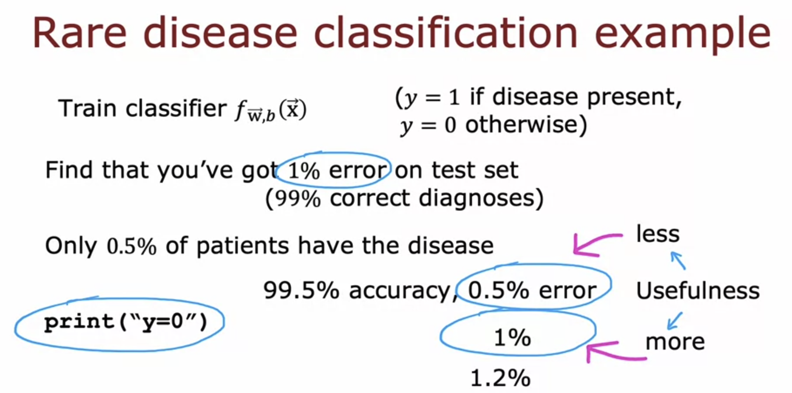
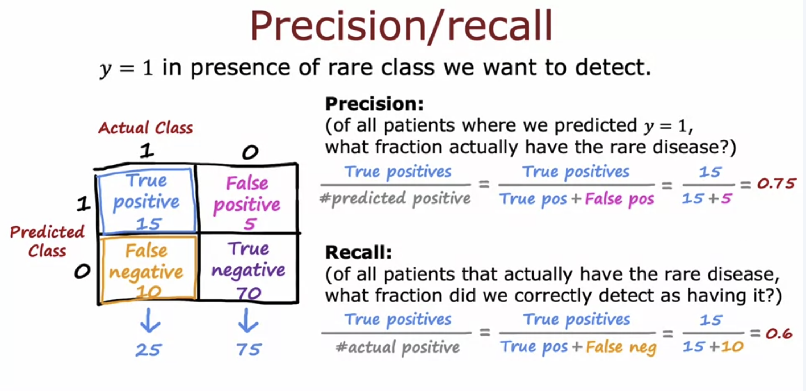
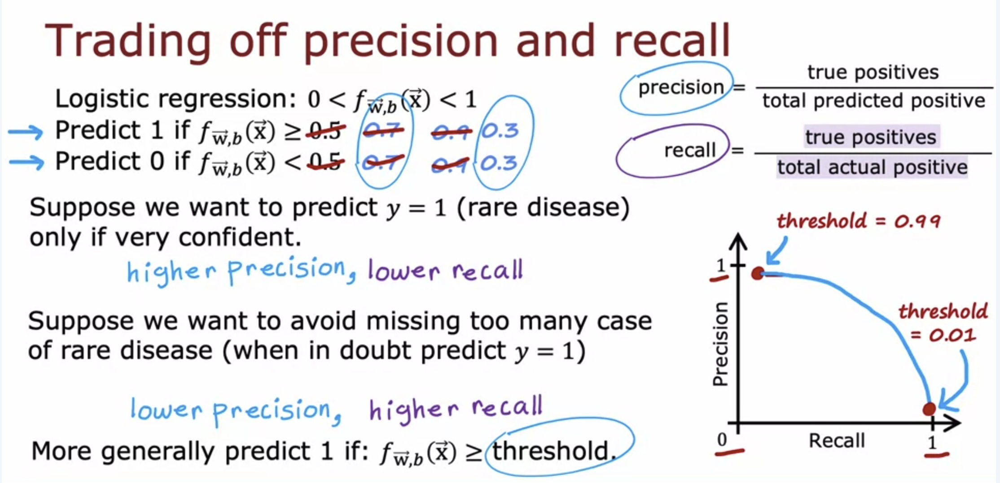
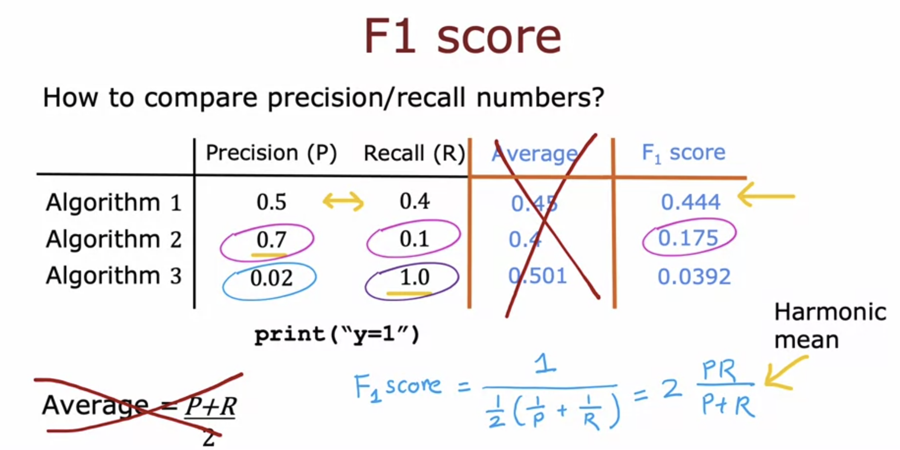

# Skewed Datasets, Precision and Recall

In a Skewed Dataset ( ratio of positive to negative examples is very far from 50-50 ), the usual error metrics like accuracy don't work that well. 

In the given example, it can be seen that on a disease classification dataset where only 0.5% patients have the disease (y=1), a model that just prints y=0 everytime will have 99.5% accuracy, but it is not at all useful, because it never predicts a person to have the disease. A model that actually predicts the person to have the disease but has 1% error might be better than this model in this case. Hence, it is difficult to judge a model just based on its accuracy in case of skewed datasets. 

## Precision, Recall and Confusion Matrix

Now, if a model predicts y=0 everytime, both these quantities will be 0, since the number of true positives is 0.

The Matrix on the left is called the Confusion Matrix. On the horizontal, we have Actual Class, and on the vertical we have Predicted Class.

**High Precision means that if the model predicts a person to have the disease, they will most probably have the disease. High Recall means that if a person has a disease, they will probably be detected by the model.**   

If we increase the threshold ( decision boundary ), we get higher precision but lower recall. By decreasing the threshold, we get lower precision but higher recall. 

### F1 Score

F1 score is a metric that is sometimes used to ​automatically tradeoff precision and recall to help ​you pick the best values of the two. 

**F1 score is calculated as the Harmonic Mean of Precision and Recall. The algorithm with a higher F1 Score is generally considered better.** 

It can be seen that the F1 score tilts more towards the smaller value, which is the property of harmonic mean. 
